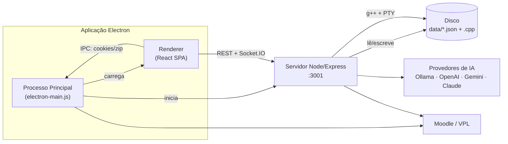

# Documentação — CPP Review App

Ferramenta pedagógica desktop para **revisão e correção de código C++** de submissões de alunos, com análise assistida por IA, terminal integrado, execução de casos de teste (estilo VPL) e importação direta do Moodle.

> **Versão:** 2.3.0 · **Plataforma:** Electron (Windows/Linux/macOS) · **Autor:** RuanPS01

---

## Índice da Documentação

### Arquitetura e Tecnologia
| Documento | Conteúdo |
|-----------|----------|
| [Arquitetura Geral](arquitetura.md) | Visão de alto nível, processos Electron, monorepo, comunicação entre camadas, diagrama de componentes |
| [Tecnologias e Bibliotecas](tecnologias-bibliotecas.md) | Stack completo, dependências e por que cada uma é usada |
| [Backend](backend.md) | Servidor Express, features modulares, rotas REST, Socket.IO/PTY, integração de IA |
| [Frontend](frontend.md) | App React, páginas, hooks, camada de serviços, navegação |
| [Componentes](componentes.md) | Catálogo de componentes React e suas responsabilidades |
| [Modelo de Dados](modelo-de-dados.md) | "Banco de dados" baseado em JSON, esquemas, diagrama ER, estrutura de diretórios |
| [Convenções de Nomes](convencoes-de-nomes.md) | Padrões de nomenclatura de arquivos, código, rotas e dados |
| [Fluxos da Aplicação](fluxos-da-aplicacao.md) | Diagramas de sequência (importar, revisar, testar, analisar com IA, Moodle) |
| [Workflows de CI/CD](workflows-ci-cd.md) | GitHub Actions: build de PR e geração de releases |

### Identidade e Implementações Específicas
| Documento | Conteúdo |
|-----------|----------|
| [Identidade Visual e Estilos](identidade-visual-estilos.md) | Paleta de cores, tipografia, temas, efeitos visuais |
| [Editor de Código](implementacao-editor-codigo.md) | Implementação do Monaco Editor |
| [Markdown e HTML](implementacao-markdown-html.md) | Renderização de enunciados |
| [Estatísticas da Turma](estatisticas.md) | Importação analítica do Moodle, métricas de engajamento e acerto, score de risco, relatórios de IA e gráficos |
| [Integração Moodle/VPL](moodle-vpl-integration-guide.md) | Guia de integração com Moodle VPL |
| [Prompt de Importação Moodle](prompt-importacao-moodle-vpl.md) | Referência do prompt/fluxo de importação |

---

## Visão Resumida



A aplicação é um **monorepo** com três partes principais:

- **`/` (raiz)** — Processo principal do Electron (`electron-main.js`, `preload.js`) que inicia o servidor embutido e abre a janela.
- **`/server`** — Backend Express + Socket.IO. Persiste tudo em **arquivos JSON** (sem banco de dados relacional). Compila e executa C++ via `g++` e PTY.
- **`/client`** — Frontend React 19 + Vite + TailwindCSS v4. SPA com navegação por estado.

## Como Executar

```bash
npm install
npm run install:all   # instala dependências de client e server
npm run dev           # inicia Vite + Electron (que inicia o servidor)
```

Pré-requisitos: **Node.js 18+**, **g++** no PATH e, opcionalmente, **Ollama** para IA local.
