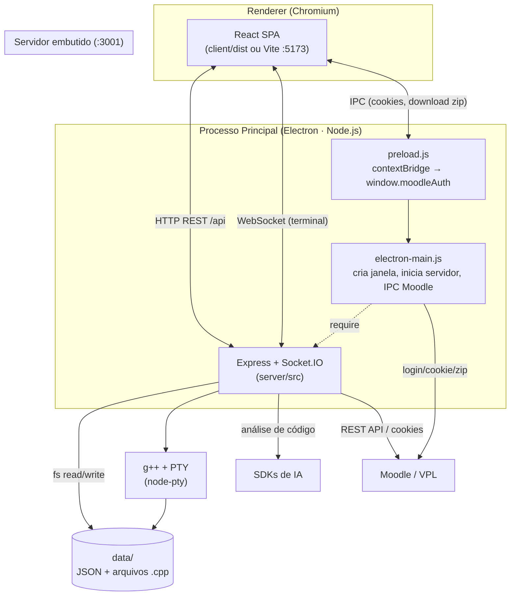
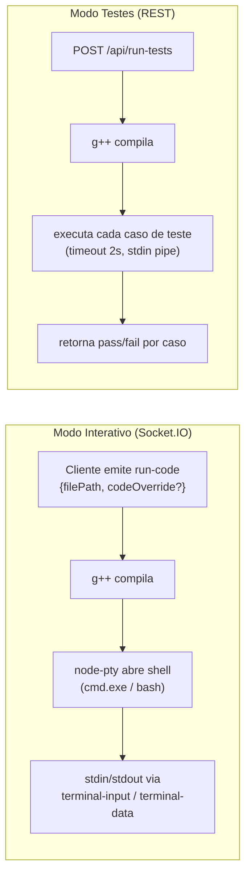

# Arquitetura Geral

Este documento descreve a arquitetura de alto nível do **CPP Review App**: como as camadas se organizam, como se comunicam e quais decisões estruturais sustentam o projeto.

## Visão Geral

A aplicação é um **desktop app Electron** composto por um monorepo com três módulos coordenados:



### Princípios estruturais

| Princípio | Descrição |
|-----------|-----------|
| **Persistência em arquivos** | Não há banco de dados. Todos os dados (notas, enunciados, casos de teste, pesos, configurações) vivem como JSON em `data/`. Submissões `.cpp` ficam em disco. |
| **Servidor embutido** | O backend roda no mesmo host do app (localhost:3001), iniciado pelo processo principal do Electron via `require('./server/index.js')`. |
| **Navegação por estado** | O frontend é um SPA sem router; a "página" é um estado (`view`) em `App.tsx`. |
| **IA plugável** | O provedor de IA (Ollama/OpenAI/Gemini/Claude) é selecionado por configuração, não por código. |
| **Execução local de C++** | Compilação com `g++` e execução interativa via pseudo-terminal (PTY), expostos ao cliente por Socket.IO. |
| **Privacidade local** | Dados de alunos e chaves de API ficam apenas no disco local (`data/` está fora do controle de versão). |

---

## As Três Camadas

### 1. Processo Principal — Electron ([electron-main.js](../electron-main.js))

Responsável pelo ciclo de vida do app desktop e por capacidades que só o Node/Electron tem:

- **Inicia o servidor** embutido com `require('./server/index.js')` (linha 6).
- **Cria a janela** `BrowserWindow` (1200×800, maximizada, sem menu, `contextIsolation: true`).
- **Carrega o frontend**: em dev, `http://localhost:5173` (Vite); em produção, `client/dist/index.html`.
- **Handlers IPC para Moodle**:
  - `open-moodle-login` — abre uma janela modal de login no Moodle, faz auto-preenchimento de credenciais e **captura o cookie `MoodleSession`** + user agent.
  - `moodle-download-zip` — baixa o ZIP de submissões via `session.defaultSession.fetch` e retorna em base64.

O [preload.js](../preload.js) expõe essas capacidades de forma segura ao renderer através de `contextBridge`:

```js
contextBridge.exposeInMainWorld('moodleAuth', {
  captureCookie: (url, credentials) => ipcRenderer.invoke('open-moodle-login', url, credentials),
  downloadZIP: (url) => ipcRenderer.invoke('moodle-download-zip', url)
});
```

### 2. Backend — Express + Socket.IO (`/server`)

Servidor HTTP na porta **3001** com arquitetura **modular orientada a features**. Ver [Backend](backend.md) para detalhes completos.

```
server/
├── index.js                 # entrypoint: chama startServer()
└── src/
    ├── server.js            # cria HTTP server + Socket.IO, listen(3001)
    ├── app.js               # Express app, CORS, body-parser 50MB, monta rotas /api
    ├── config/env.js        # DATA_DIR, SETTINGS_FILE, defaults; cria diretórios
    ├── core/socket.js       # eventos de terminal: run-code, terminal-input/resize
    ├── middleware/upload.js  # multer (uploads de ZIP)
    ├── utils/fileHelpers.js  # caminhos de arquivos, parsing de pastas, busca de .cpp
    └── features/
        ├── ai/              # POST /api/analyze
        ├── classes/         # turmas, pesos, enunciados, casos de teste
        ├── grades/          # notas: update, export, import
        ├── import/          # importação ZIP e Moodle/VPL
        ├── settings/        # configuração de IA
        ├── students/        # alunos e leitura de código
        └── tests/           # execução de casos de teste
```

Cada feature segue o par **`*.routes.js`** (define endpoints) + **`*.controller.js`** (lógica).

### 3. Frontend — React SPA (`/client`)

SPA React 19 com Vite e TailwindCSS v4. Ver [Frontend](frontend.md) e [Componentes](componentes.md).

```
client/src/
├── main.tsx              # bootstrap React
├── App.tsx               # estado global, navegação por view, header
├── pages/                # ReviewPage, TablePage, ImportPage, SettingsPage
├── components/           # Modal, TerminalPanel, MoodleImportWizard, GlobalAIAnalysisView
├── hooks/                # useReviewLogic, useGlobalAI
├── services/             # api.ts (REST), moodle.ts (Moodle REST API)
├── types/index.ts        # modelo de dados TypeScript
├── translations.ts       # i18n pt-BR / en-US
└── index.css             # tema (CSS variables) + Tailwind v4
```

---

## Comunicação Entre Camadas

| Origem | Destino | Mecanismo | Uso |
|--------|---------|-----------|-----|
| Renderer | Backend | HTTP REST (`axios`) sob `/api` | CRUD de notas, importação, configurações, análise IA, testes |
| Renderer | Backend | WebSocket (`socket.io-client`) | Terminal interativo: enviar input, receber output, redimensionar |
| Renderer | Processo principal | IPC (`window.moodleAuth`) | Captura de cookie do Moodle e download de ZIP |
| Backend | Disco | `fs` (síncrono/assíncrono) | Persistência de JSON e leitura de `.cpp` |
| Backend | SO | `child_process` / `node-pty` + `g++` | Compilar e executar código C++ |
| Backend | Provedores IA | SDKs HTTP | Análise de código (score + comentário) |

### Resolução de Base URL da API ([api.ts](../client/src/services/api.ts))

O cliente resolve a URL do backend dinamicamente para funcionar em **local**, **Electron** e **GitHub Codespaces** (troca a porta 5173/3000 por 3001 no hostname do Codespace). O padrão local é `http://localhost:3001/api`.

---

## Execução de Código C++

A execução acontece de duas formas, ambas no backend:



- **Interativo**: o usuário roda o programa num terminal embutido (xterm.js) e digita entradas ao vivo.
- **Testes (VPL)**: o backend roda todos os casos de teste configurados, compara saídas e devolve resultados.

---

## Build e Distribuição

| Comando | Ação |
|---------|------|
| `npm run dev` | `concurrently`: Vite (client) + Electron (que inicia o servidor) |
| `npm run build:client` | `tsc -b && vite build` → `client/dist` |
| `npm run electron:build` | Aplica patch no `node-pty`, builda o client e empacota com `electron-builder` (NSIS no Windows, saída em `dist-electron/`) |

O `electron-builder` empacota `electron-main.js`, `preload.js`, `server/**`, `client/dist/**` e `node_modules` num instalador, com `asar: true`.

> O script `scripts/patch-node-pty.js` é necessário porque `node-pty` é uma dependência nativa que precisa de tratamento especial no empacotamento.
