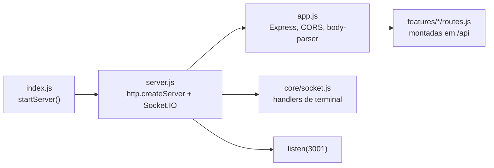
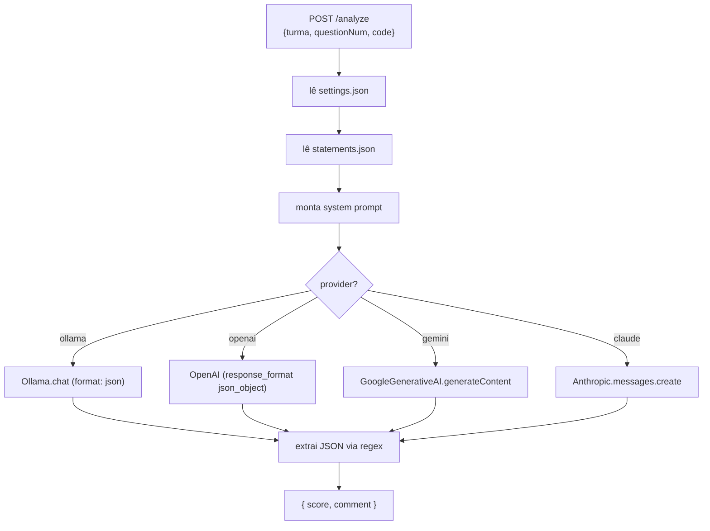

# Backend

O backend é um servidor **Express 5 + Socket.IO** rodando em `localhost:3001`, com arquitetura **modular orientada a features**. Não há banco de dados: tudo é persistido em arquivos JSON em `data/` (ver [Modelo de Dados](modelo-de-dados.md)).

## Inicialização



- **[server/index.js](../server/index.js)** — entrypoint de uma linha: chama `startServer()`.
- **[server/src/server.js](../server/src/server.js)** — cria o servidor HTTP, anexa o Socket.IO, registra os handlers de socket e escuta na porta **3001**.
- **[server/src/app.js](../server/src/app.js)** — instancia o Express, habilita **CORS** (todas as origens), aplica `body-parser` com limite de **50MB** e monta os roteadores sob o prefixo `/api`.

### Configuração ([config/env.js](../server/src/config/env.js))

Define e cria os diretórios de dados na primeira execução:

| Constante | Valor |
|-----------|-------|
| `DATA_DIR` | Electron: `{userData}/data` · Node: `{repo}/data` |
| `UPLOADS_DIR` | `{DATA_DIR}/uploads` (uploads temporários do multer) |
| `SETTINGS_FILE` | `{DATA_DIR}/settings.json` |
| `DEFAULT_SETTINGS` | provider `ollama`, model `llama3`, critérios de avaliação padrão |

---

## Mapa de Rotas REST

Todas as rotas têm prefixo `/api`.

| Método | Rota | Feature | Descrição |
|--------|------|---------|-----------|
| POST | `/import` | import | Importa submissões via ZIP (multer) |
| POST | `/import-moodle` | import | Importa via API do Moodle |
| POST | `/import-moodle-cookies` | import | Importa via scraping (cookie) do VPL |
| POST | `/process-vpl-zip` | import | Adiciona uma questão a uma turma existente |
| GET / POST | `/settings` | settings | Lê / grava configuração de IA |
| DELETE | `/turma/:name` | classes | Apaga turma (notas, enunciados, pasta) |
| GET / POST | `/weights` | classes | Lê / grava pesos das questões |
| GET / POST | `/statements` | classes | Lê / grava enunciados |
| GET | `/testcases` | classes | Lê casos de teste |
| GET | `/students` | students | Lista todos os alunos (todas as turmas) |
| GET | `/code` | students | Lê o conteúdo de um arquivo `.cpp` |
| POST | `/update-student` | students | Edita nome/id/reviewed do aluno |
| POST | `/update-grade` | grades | Atualiza nota/comentário de uma questão |
| GET | `/export-grades/:turma` | grades | Exporta as notas da turma (JSON) |
| POST | `/import-grades` | grades | Mescla notas importadas |
| POST | `/run-tests` | tests | Compila e roda casos de teste |
| POST | `/analyze` | ai | Análise de código por IA |

---

## Features

Cada feature combina **`*.routes.js`** (endpoints) e **`*.controller.js`** (lógica).

### Feature: import
[import.controller.js](../server/src/features/import/import.controller.js)

- **`importZip`** — recebe ZIP + `turma` + `folderTemplate`. Extrai (com fallback de encoding CP850), identifica pastas de alunos via template regex (`[NAME] [ID] [EMAIL] [IGNORE]`), localiza os `.cpp` recursivamente e gera `grades_turma_{turma}.json`.
- **`importMoodle`** — recebe questões e submissões já obtidas via API; cria a pasta da turma, salva `statements.json` e o arquivo de notas.
- **`importMoodleCookies`** — usa cookie do Moodle para buscar páginas VPL, faz parsing de enunciados e **casos de teste** (`<pre id="codefileid1">`), baixa o ZIP de submissões e grava `statements.json` + `testcases.json`.
- **`processVplZip`** — adiciona/atualiza uma única questão numa turma existente, mesclando com as notas atuais.

### Feature: settings
[settings.controller.js](../server/src/features/settings/settings.controller.js)

- **`getSettings`** / **`updateSettings`** — leitura e escrita de `settings.json`. Esquema:

```json
{
  "provider": "ollama | openai | gemini | claude",
  "ollamaModel": "llama3",
  "cloudModel": "gpt-4o | gemini-1.5-flash-lite | claude-3-5-sonnet-...",
  "cloudKey": "API_KEY",
  "evaluationCriteria": "texto/markdown com os critérios de correção"
}
```

### Feature: classes
[classes.controller.js](../server/src/features/classes/classes.controller.js)

Gerencia recursos por turma:
- **`deleteTurma`** — remove o arquivo de notas, enunciados e a pasta `turma_{name}`.
- **`getWeights` / `updateWeights`** — `weights.json` (peso percentual por questão).
- **`getStatements` / `updateStatements`** — `statements.json`.
- **`getTestCases`** — `testcases.json`.

### Feature: students
[students.controller.js](../server/src/features/students/students.controller.js)

- **`getStudents`** — agrega todos os `grades_turma_*.json` e injeta o campo `turma` em cada aluno.
- **`getCode`** — lê um arquivo de código; valida que o caminho está dentro de `DATA_DIR` (proteção contra *path traversal*).
- **`updateStudent`** — atualiza nome/id/reviewed casando por `folder_name`.

### Feature: grades
[grades.controller.js](../server/src/features/grades/grades.controller.js)

- **`updateGrade`** — atualiza `score`/`comment`/`reviewed` de uma questão e recalcula o flag `reviewed` geral do aluno. Aceita chave de questão tanto como `q1` quanto `1`.
- **`exportGrades`** — devolve o JSON completo da turma.
- **`importGrades`** — mescla notas importadas casando por `folder_name` ou `id`, atualizando apenas `score`/`comment`.

### Feature: tests
[tests.controller.js](../server/src/features/tests/tests.controller.js)

- **`runTests`** — recebe `{turma, studentId, questionNum, filePath, code?}`. Busca os casos de teste, opcionalmente grava o `code` num arquivo temporário, compila com `g++` e executa cada caso (entrada via stdin, **timeout de 2s**), comparando saída esperada × obtida. Retorna `{success, results:[{name, input, expected, actual, passed, duration}]}` e limpa os temporários.

### Feature: ai
[ai.controller.js](../server/src/features/ai/ai.controller.js)

- **`analyzeCode`** — recebe `{turma, questionNum, code}`. Lê as `settings`, monta o *system prompt* (critérios + enunciado) e chama o provedor selecionado. A resposta é parseada com regex `/\{[\s\S]*\}/` e devolvida como `{score, comment}`.



---

## Terminal e Execução Interativa ([core/socket.js](../server/src/core/socket.js))

O Socket.IO expõe a execução interativa de código C++ via PTY:

| Evento | Direção | Payload | Ação |
|--------|---------|---------|------|
| `run-code` | cliente → servidor | `{filePath, codeOverride?}` | Compila (`g++`) e, se ok, abre um PTY e executa o binário |
| `terminal-data` | servidor → cliente | string | Stream de saída (compilação + execução) |
| `terminal-input` | cliente → servidor | string | Escreve no stdin do PTY |
| `terminal-resize` | cliente → servidor | `{cols, rows}` | Redimensiona o PTY |
| `disconnect` | — | — | Mata o PTY ativo |

Detalhes:
- Se `codeOverride` é enviado, um arquivo temporário (`{nome}_test{ext}`) é criado e marcado para remoção.
- O PTY usa `cmd.exe` no Windows e `bash` no Unix, buffer `80×24`, modo `xterm-color`.
- Após compilar com sucesso, aguarda ~500ms e executa o binário automaticamente.
- Ao sair, envia o código de saída e limpa temporários após 1s.

---

## Utilitários ([utils/fileHelpers.js](../server/src/utils/fileHelpers.js))

| Função | Papel |
|--------|-------|
| `getStatementsPath(turma)` | `{DATA_DIR}/turma_{turma}/statements.json` |
| `getTestCasesPath(turma)` | `{DATA_DIR}/turma_{turma}/testcases.json` |
| `getWeightsPath(turma)` | `{DATA_DIR}/turma_{turma}/weights.json` |
| `findCppInDir(dir)` | Busca recursiva por `.cpp` (ignora pastas `.ceg`) |
| `parseFolderWithTemplate(folder, template)` | Converte template (`[NAME]`/`[ID]`/`[EMAIL]`/`[IGNORE]`) em regex e extrai metadados do aluno |

### Template de pastas → regex

| Token | Captura | Regex |
|-------|---------|-------|
| `[NAME]` | nome | `.+?` (não-guloso) |
| `[ID]` | matrícula | `\d+` |
| `[EMAIL]` | e-mail | `\S+` |
| `[IGNORE]` | (descarta) | `\S+` sem captura |

Espaços no template viram `\s+` para tolerar espaçamento variável.

---

## Padrões do Backend

- **CommonJS** (`require`/`module.exports`), Node puro.
- Persistência síncrona com `fs` para JSON; leitura/escrita direta de arquivos.
- Caminhos sempre derivados de `DATA_DIR` (nunca caminhos absolutos hardcoded).
- Validação de segurança em leitura de arquivos (`getCode` confina ao `DATA_DIR`).
- Limpeza de artefatos temporários (binários `.exe`, arquivos `_test`) após execução.
