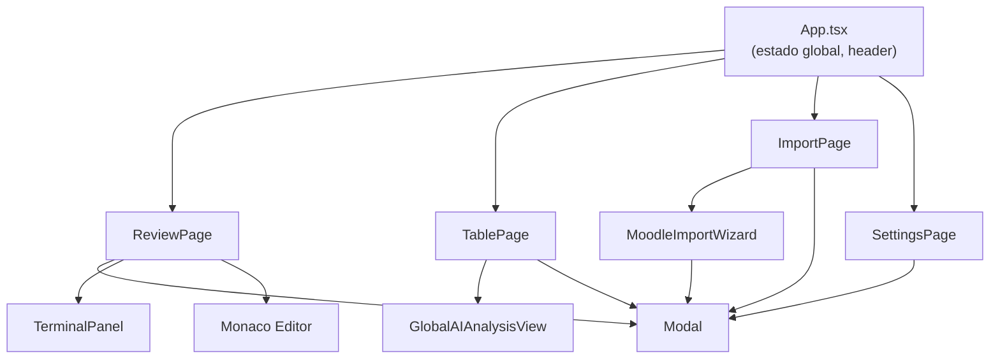
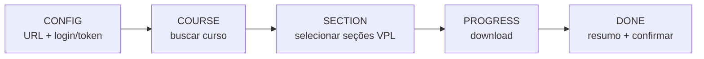

# Componentes

Catálogo dos componentes React reutilizáveis em `client/src/components/`. As páginas (`pages/`) estão documentadas em [Frontend](frontend.md).

## Hierarquia

---

## Modal — [components/Modal.tsx](../client/src/components/Modal.tsx)

Wrapper genérico de diálogo com animação **CRT** (ver [identidade visual](identidade-visual-estilos.md)).

**Props:**
| Prop | Tipo | Descrição |
|------|------|-----------|
| `isOpen` | `boolean` | Visibilidade |
| `onClose` | `() => void` | Fechar |
| `title` | `string` | Título do cabeçalho |
| `icon` | `React.ElementType` | Ícone (lucide-react) |
| `children` | `React.ReactNode` | Conteúdo |
| `maxWidth?` | `string` | Largura máx. (padrão `max-w-2xl`) |
| `maxHeight?` | `string` | Altura máx. opcional |

Características: animação de entrada/saída, overlay com `backdrop-blur`, cabeçalho com ícone + título + botão de fechar. Reutilizado por: enunciado, pesos, preview de IA, ajuda, edição de aluno e o assistente do Moodle.

---

## TerminalPanel — [components/TerminalPanel.tsx](../client/src/components/TerminalPanel.tsx)

Emulador de terminal para rodar código C++ ao vivo. Usa **xterm.js** + **@xterm/addon-fit** + **socket.io-client**.

**Props:**
| Prop | Tipo | Descrição |
|------|------|-----------|
| `isOpen` | `boolean` | Visibilidade |
| `filePath` | `string` | Caminho do `.cpp` a executar |
| `codeOverride?` | `string` | Código editado a compilar em vez do arquivo em disco |
| `onClose` | `() => void` | Fechar |
| `t` | `Record<string,string>` | Traduções |
| `theme` | `'light' \| 'dark'` | Tema |

Características:
- Dois modos: **foco** (tela cheia) e **livre** (janela flutuante arrastável e redimensionável; mínimo 400×300), preferência persistida em `localStorage`.
- Cores sensíveis ao tema; auto-fit ao container.
- Comunicação com o backend via eventos `run-code`, `terminal-input`, `terminal-resize` (emite) e `terminal-data` (recebe).

---

## MoodleImportWizard — [components/MoodleImportWizard.tsx](../client/src/components/MoodleImportWizard.tsx)

Assistente multi-etapas para importar atividades do Moodle/VPL.

**Etapas:**

Características:
- Autenticação por token **ou** fallback por cookie (captura via IPC do Electron).
- **Seleção múltipla de seções**: várias seções do mesmo curso viram uma única
  turma, com as questões numeradas continuamente (`q1..qn`) e o nome da seção no
  rótulo de cada questão para desambiguar homônimas. O nome da turma é sugerido
  a partir da seleção e pode ser editado.
- `folderTemplate` para nomear pastas dos alunos.
- Acompanhamento de progresso com mensagens de status.
- Limpeza de importações não confirmadas (apaga a turma).
- Persiste URL e usuário do Moodle em `localStorage`.

Ver [Integração Moodle/VPL](moodle-vpl-integration-guide.md).

---

## GlobalAIAnalysisView — [components/GlobalAIAnalysisView.tsx](../client/src/components/GlobalAIAnalysisView.tsx)

UI da análise por IA **em lote** (toda a turma). Renderizada pela TablePage quando `globalAI.isActive`.

**Props principais:** `items: AnalysisItem[]`, `isAnalyzing`, `progress`, `onlyUnreviewed`, `selectedTurma`, e callbacks `onStart`, `onCancel`, `onResume`, `onBack`, `onRetry`, `onRetryAllErrors`, `onRetryRemaining`, `onApplyAll`, além de `t`.

Características:
- Passo de confirmação com opção "apenas não revisados".
- Barra de progresso ao vivo e lista de itens com status (`pending`/`analyzing`/`success`/`error`).
- Botões de retentativa (individual, só erros, todos os restantes) e "aplicar todos".

É alimentada pelo hook [useGlobalAI](frontend.md#useglobalai--hooksuseglobalaits).

---

## Padrões de Componentes

| Padrão | Aplicação |
|--------|-----------|
| **Wrapper reutilizável** | `Modal` padroniza todos os diálogos |
| **Componentes controlados** | Estado vive no pai (App/páginas); componentes recebem props + callbacks |
| **i18n via prop `t`** | Componentes recebem o dicionário de traduções, não importam direto |
| **Tema via prop** | `theme` é passado explicitamente onde o estilo depende dele (ex: terminal, editor) |
| **Persistência local** | Preferências de UI (modo do terminal, layout) em `localStorage` |
