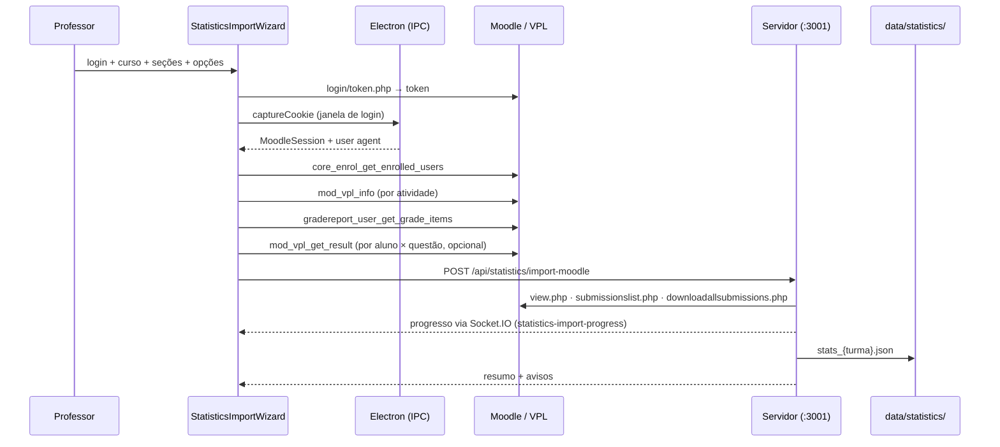

# Estatísticas da Turma

A aba **Estatísticas** transforma os dados do Moodle/VPL em evidências de engajamento, acerto e dificuldade, com alertas de alunos em risco, análises textuais geradas por IA e exportação em CSV para análise externa.

Ela é **independente da aba de Revisão**: tem a própria importação, o próprio dataset em disco e não altera notas nem arquivos de correção.

---

## 1. Visão geral do fluxo



O cliente coleta o que o **Web Service** permite; o servidor espelha as **páginas HTML do VPL** com a sessão do navegador. Cada fonte é opcional: se uma falhar, a importação continua e o motivo entra em `warnings`, exibido na tela.

**Várias seções por importação.** É possível marcar quantas seções do curso quiser: elas viram um único dataset, com as questões numeradas continuamente (`q1..qn`) e cada uma guardando de qual seção veio (campo `section`, exibido na aba Questões). O nome da turma é sugerido a partir da seleção (`Curso - P1 + P2`) e pode ser editado antes de importar. O formato antigo, de seção única, continua aceito pelo endpoint.

---

## 2. Dados coletados

| Fonte | Como | O que traz |
|-------|------|-----------|
| `core_enrol_get_enrolled_users` | Web Service | Alunos matriculados, e-mail, grupos, último acesso — inclusive quem **nunca entregou** |
| `mod_vpl_info` | Web Service | Enunciado, casos de teste (`vpl_evaluate.cases`), nota máxima, datas |
| `core_course_get_contents` | Web Service | Prazos (`dates[]`) de cada atividade |
| `gradereport_user_get_grade_items` | Web Service | Nota por atividade (fallback quando `mod_vpl_*` está bloqueado) |
| `mod_vpl_get_result` | Web Service (opcional) | Nota, **casos de teste reprovados** e **erros de compilação** por aluno |
| `mod/vpl/view.php` | Espelhamento (cookie) | Enunciado e casos de teste quando o WS não responde |
| `mod/vpl/views/submissionslist.php` | Espelhamento (cookie) | Data do envio, número de tentativas, nota, avaliação |
| `mod/vpl/views/downloadallsubmissions.php` | Espelhamento (cookie) | **Código-fonte** de cada aluno e o carimbo de data/hora da submissão |
| `mod/vpl/views/previoussubmissionslist.php` | Espelhamento (cookie, opcional) | Histórico completo de tentativas — mede persistência |

Os parsers de HTML são tolerantes: identificam as colunas pelo cabeçalho (PT/EN), caem em heurísticas quando não reconhecem e devolvem `null` em vez de derrubar a importação.

---

## 3. Seleção: uma ou várias turmas ao mesmo tempo

O seletor do topo é de **múltipla escolha**. Marcando mais de uma importação, `mergeDatasets` consolida tudo em um dataset único antes do cálculo — a tela inteira (visão geral, engajamento, questões, alunos, alertas, IA e exportação) passa a operar sobre o conjunto.

Três regras sustentam a consolidação:

| Regra | Por quê |
|-------|---------|
| **Chaves de questão prefixadas** (`{turma}::q1`) quando há mais de uma turma | O `q1` de uma turma sobrescreveria o da outra. Cada questão guarda `turma` e `sourceKey` (a chave original). Com uma turma só, as chaves ficam como antes — importações e relatórios antigos continuam válidos. |
| **Aluno unificado entre turmas** | O mesmo aluno pode aparecer em várias importações com metadados diferentes (uma com `userId` do Web Service, outra só com a pasta do ZIP). A identidade é resolvida por `userId` → e-mail → login → matrícula → pasta → nome, registrando todos os apelidos. O registro consolidado guarda `turmas[]`. |
| **Cada aluno responde só pelas questões das suas turmas** | Cobrar do aluno da turma A a questão da turma B faria toda questão parecer impossível e todo aluno parecer ausente. Por isso `expected` de uma questão conta apenas os alunos da turma dela, e o total esperado de entregas é a **soma das questões de cada aluno**, não `alunos × questões`. |

A visão combinada acrescenta:

- **`byTurma`** — a visão geral de cada turma calculada isoladamente, sem duplicar a regra de agregação (`computeMetrics` chama a si mesmo por turma). É o que alimenta a tabela **Comparação entre turmas** na aba Visão Geral.
- **Origem visível** — turma aparece nas abas Questões, Alunos e Alertas, e no detalhe de cada aluno.
- **Fontes parciais** — uma fonte só é marcada como "disponível" se existir em todas as turmas selecionadas; quando existe em parte delas, aparece como **parcial** (`sourcesPartial`).
- **Avisos prefixados** — cada aviso de coleta mostra de qual turma veio.

> Comparar turmas é seguro para taxa de entrega, atrasos e distribuição de risco. Média de nota só é comparável se as atividades forem equivalentes — as turmas normalmente têm questões diferentes. O subtítulo da tabela de comparação diz isso.

A seleção fica em `localStorage`, então o recorte sobrevive à troca de aba e ao reinício do app.

---

## 4. Ignorar alunos sem histórico

O Moodle costuma trazer cadastros que não têm nada a ver com a disciplina: matrícula cancelada, trancamento ou conta que nunca se inscreveu na matéria. Eles entram na lista de matriculados, nunca entregam nada e **puxam para baixo a taxa de entrega, inflam o índice de dificuldade e enchem os alertas de falsos críticos**.

O botão **Ignorar sem histórico** (persistido em `localStorage`) descarta esses cadastros de todas as métricas e de todas as exportações. O critério é conservador — um aluno é considerado **sem histórico** quando, em todas as questões das turmas dele, não existe:

- entrega registrada, nem
- nota (do VPL ou do livro de notas), nem
- tentativa, nem
- código-fonte capturado ou arquivos, nem
- saída de avaliação automática, nem
- histórico de tentativas.

Qualquer vestígio de atividade mantém o aluno na conta. Acesso ao curso **não** conta como histórico: entrar no Moodle sem nunca enviar exercício é justamente o sinal de risco que a tela quer mostrar.

A tela nunca esconde o efeito do filtro:

- uma faixa abaixo das abas informa quantos alunos ficaram de fora e permite listar os nomes (`metrics.excludedStudents`);
- o seletor de turmas mostra quantos cadastros sem histórico cada importação tem, antes de selecioná-la (`emptyStudentCount`);
- `overview.excludedStudents` viaja nas métricas e na coluna `students_ignored` do CSV `overview.csv`;
- o guia dentro do ZIP registra qual recorte gerou aquela exportação.

---

## 5. Métricas calculadas

`statistics.service.js` é uma função pura sobre os datasets salvos — recalcular é barato e importações antigas se beneficiam de regras novas.

### Por questão
Taxa de entrega, média/mediana/desvio das notas, taxa de aprovação, zeros, notas máximas, tentativas médias, taxa de erro de compilação, entregas atrasadas, histograma de notas, casos de teste que mais falharam, erros de compilação frequentes e uso de conceitos de C++.

**Índice de dificuldade** = `100 − (média × entregues / esperados)`. Quem não entregou conta como dificuldade — senão a questão que ninguém tentou pareceria fácil.

### Por aluno
Entregas, média, mediana, melhor/pior nota, tentativas, atrasos, erros de compilação, primeira/última submissão, conceitos usados, turmas de origem e o **score de risco**.

### Score de risco (0–100)

| Sinal | Peso |
|-------|------|
| Nenhuma entrega | 60 (crítico direto) |
| Questões sem entrega | até 45, proporcional |
| Média abaixo da aprovação (60%) | até 40, proporcional |
| Entregas atrasadas | até 10, proporcional |
| ≥ 8 tentativas sem atingir a média | 8 |

Faixas: **crítico** ≥ 60 · **alto** ≥ 40 · **médio** ≥ 20 · **ok** abaixo disso. Cada parcela devolve o motivo em texto, para que o alerta explique *por que* o aluno foi sinalizado.

### Engajamento
Submissões por hora, por dia da semana, matriz dia × hora, linha do tempo diária, antecedência em relação ao prazo (de "> 48h antes" a "após o prazo") e distribuição de tentativas.

### Cruzamento com a correção
Para cada turma selecionada, se existir uma turma de correção com o mesmo nome (`grades_turma_{turma}.json`), a tela compara a nota automática do VPL com a nota lançada pelo professor e destaca as maiores divergências.

---

## 6. Análises de IA

Quatro relatórios, gerados sob demanda e mantidos em cache (`stats_{turma}.reports.json`) para não gastar tokens a cada visita:

| Relatório | Contexto enviado ao modelo |
|-----------|---------------------------|
| **Diagnóstico geral** | Métricas agregadas (sem código) |
| **Análise da questão** | Enunciado, casos de teste, métricas e amostra de códigos (as piores notas + duas boas, para contraste) |
| **Diagnóstico individual** | Métricas do aluno, média da turma e seus códigos |
| **Plano de intervenção** | Lista de alunos sinalizados com motivos e números |

Os prompts usam o provedor definido em **Configurações** (Ollama, OpenAI, Gemini ou Claude) através de `ai.service.js`, compartilhado com a correção de código.

**O escopo faz parte da chave do cache.** Um diagnóstico de duas turmas juntas não é o diagnóstico de cada uma, então a chave é `{turmas ordenadas}##{kind}[:targetId]`. Relatórios de um recorte combinado ficam guardados no arquivo da primeira turma em ordem alfabética; chaves antigas (sem escopo) são interpretadas como pertencentes à turma do próprio arquivo, o que mantém visíveis os relatórios gerados antes desta versão. Cliente e servidor derivam a chave pela mesma regra (`reportKey` em `services/statistics.ts`).

---

## 7. Exportação em CSV

O botão **Exportar CSV** abre o catálogo de tabelas do recorte atual — cada uma com a contagem de linhas e colunas antes do download. Dá para levar **uma tabela isolada** (CSV único) ou **um pacote em ZIP** com as tabelas escolhidas.

O recorte exportado é exatamente o da tela: as turmas selecionadas e o filtro de alunos sem histórico.

### O que existe

**Transversais** — um retrato do momento:

| Arquivo | Tabela | Conteúdo |
|---------|--------|----------|
| `overview.csv` | Visão geral | Uma linha por turma da seleção (e uma linha combinada quando há mais de uma) com os indicadores agregados. |
| `questions.csv` | Questões | Uma linha por questão com dificuldade, dispersão das notas, tentativas, atrasos e erros de compilação. |
| `students.csv` | Alunos | Uma linha por aluno com entregas, notas, esforço, atrasos e o score de risco. |
| `submissions.csv` | Entregas (aluno × questão) | A tabela-fato: uma linha por par aluno × questão esperada, inclusive quando não houve entrega. |
| `risk_reasons.csv` | Composição do risco | Formato longo: uma linha por motivo que somou pontos no score de risco. |
| `question_failed_cases.csv` | Casos de teste reprovados | Contagem de reprovações por caso de teste, sem o limite de 8 da tela. |
| `question_compile_errors.csv` | Erros de compilação | Mensagens do compilador agrupadas por questão, com ocorrências. |
| `code_metrics.csv` | Métricas do código | Métricas estáticas de cada entrega com código, incluindo conceitos e práticas. |
| `concept_coverage.csv` | Conceitos por aluno | Percentual de alunos que usou cada construção de C++. |
| `question_concepts.csv` | Conceitos por questão | Formato longo: uso de cada conceito dentro de cada questão. |
| `code_smells.csv` | Práticas detectadas | Frequência de `using namespace std`, `goto`, variáveis globais, `system("pause")`. |
| `grade_histogram.csv` | Histogramas de nota | Faixas de 10% das médias por aluno e das notas de cada questão. |
| `professor_comparison.csv` | VPL × professor | Nota automática contra a nota lançada na aba de Revisão. |

**Séries temporais**:

| Arquivo | Tabela | Conteúdo |
|---------|--------|----------|
| `submission_events.csv` | Eventos de envio | Espinha temporal: uma linha por envio (cada tentativa, quando o histórico completo foi importado). |
| `timeline_daily.csv` | Série diária por turma | Envios por dia, alunos ativos no dia e acumulado. |
| `student_daily_activity.csv` | Atividade diária por aluno | Dados em painel (aluno × dia) — mede regularidade e abandono. |
| `question_timeline.csv` | Série diária por questão | Envios por dia com a distância até o prazo. |
| `activity_by_hour.csv` | Envios por hora | 24 linhas por turma, inclusive as horas com zero. |
| `activity_by_weekday.csv` | Envios por dia da semana | 7 linhas por turma. |
| `activity_heatmap.csv` | Matriz dia × hora | 168 linhas por turma, formato longo para `pivot`. |
| `lead_time.csv` | Antecedência das entregas | Faixas de antecedência, questão por questão. |

**Unificados** — tabelas largas, prontas para abrir em um notebook sem nenhum `merge`:

| Arquivo | Tabela | Conteúdo |
|---------|--------|----------|
| `unified_submissions.csv` | Entregas desnormalizadas | Cada entrega esperada com atributos do aluno, da questão, do tempo e do código na mesma linha. |
| `unified_students.csv` | Perfil do aluno | Desempenho, risco, hábitos de horário (madrugada, fim de semana, antecedência) e conceitos dominados. |
| `unified_events.csv` | Eventos enriquecidos | Cada envio no tempo com o perfil do aluno e as características da questão. |
| `students_wide.csv` | Planilha de notas | Alunos × questões, quatro colunas por questão (nota, entrega, tentativas, atraso). |

### Convenções dos arquivos

- UTF-8 **sem BOM**, separador vírgula, ponto decimal — `pd.read_csv` sem parâmetros extras.
- Célula vazia = dado ausente (`NaN`). Vazio em `percent` é "sem nota", diferente de nota 0.
- Booleanos como `True`/`False`; listas em uma célula separadas por ` | `.
- Datas em ISO 8601 no **fuso local** da máquina que exportou, com `*_epoch` em milissegundos (UTC) ao lado. Hora, dia da semana e mapa de calor seguem o mesmo fuso.
- Chaves de junção: `student_key`, `question_key` e `turma`.
- Uma linha por observação. A única tabela com linha de total é `overview.csv`, onde `scope = "__combinado__"`.

### Markdown que acompanha o ZIP

Por padrão o ZIP leva dois arquivos gerados a partir das mesmas definições das tabelas — documentação e dado não têm como divergir:

- **`LEIA-ME.md`** — o recorte exportado, as convenções, os primeiros comandos em pandas e onze receitas de análise (análise de itens e índice de discriminação, correlação entre questões, esforço × resultado, procrastinação, ritmo da turma no tempo, hábitos de horário, regularidade e abandono, validação do score de risco, comparação entre turmas, conceitos de C++, clusterização de perfis), fechando com oito cuidados de interpretação.
- **`DICIONARIO-DE-DADOS.md`** — o significado de cada coluna de cada tabela, o grão (quantas linhas, quantas colunas) e um glossário dos conceitos que aparecem em várias tabelas (nota percentual, aprovação, índice de dificuldade, score de risco, aluno sem histórico, tentativa).

O ZIP fica assim:

```
estatisticas_{turmas}_{AAAAMMDD-HHMM}.zip
├── LEIA-ME.md
├── DICIONARIO-DE-DADOS.md
└── csv/
    ├── overview.csv
    ├── submissions.csv
    └── ...
```

---

## 8. Arquivos

### Backend — `server/src/features/statistics/`
| Arquivo | Responsabilidade |
|---------|------------------|
| `statistics.routes.js` | Rotas REST |
| `statistics.controller.js` | Importação, consulta, exportação e geração de relatórios |
| `statistics.service.js` | Consolidação de datasets e motor de métricas (função pura) |
| `statistics.export.js` | Catálogo de tabelas, CSV, ZIP e os markdowns de apoio |
| `statistics.prompts.js` | Montagem dos prompts pedagógicos |
| `moodleHarvester.js` | Sessão HTTP autenticada e parsers das páginas do VPL |
| `codeMetrics.js` | Métricas estáticas do código C++ |

### Rotas
| Método | Rota | Função |
|--------|------|--------|
| POST | `/api/statistics/import-moodle` | Coleta e consolida o dataset |
| GET | `/api/statistics/datasets` | Lista importações salvas (com a contagem de alunos sem histórico) |
| GET | `/api/statistics/dataset?turmas=&ignoreEmpty=` | Métricas calculadas do recorte |
| GET | `/api/statistics/submission-code?turmas=&userId=&question=` | Código e avaliação de uma submissão |
| DELETE | `/api/statistics/dataset/:turma` | Remove importação e relatórios |
| GET | `/api/statistics/export/manifest?turmas=&ignoreEmpty=` | Catálogo de tabelas com contagem de linhas |
| GET | `/api/statistics/export?turmas=&tables=&bundle=csv\|zip&docs=` | CSV único ou ZIP |
| GET | `/api/statistics/ai-reports?turmas=` | Relatórios em cache das turmas selecionadas |
| POST | `/api/statistics/ai-report` | Gera um relatório para o recorte |

A seleção de turmas viaja como **JSON** (`turmas=["A","B"]`) porque nome de turma pode conter vírgula; o endpoint também aceita `turma=` único, mantendo compatibilidade.

### Frontend
| Arquivo | Responsabilidade |
|---------|------------------|
| `pages/StatisticsPage.tsx` | Orquestra as seis sub-abas, a seleção de turmas, o filtro e a exportação |
| `hooks/useStatistics.ts` | Estado: importações, seleção, filtro, métricas e relatórios |
| `components/statistics/StatisticsImportWizard.tsx` | Assistente de importação com log da coleta |
| `components/statistics/DatasetSelector.tsx` | Seletor de importações com múltipla escolha |
| `components/statistics/StatisticsExportPanel.tsx` | Catálogo de exportação (CSV único ou ZIP) |
| `components/statistics/TurmaComparison.tsx` | Tabela e gráfico de comparação entre turmas |
| `components/statistics/{Overview,Engagement,Questions,Students,Alerts,AIInsights}Panel.tsx` | Sub-abas |
| `components/statistics/charts/` | Gráficos SVG próprios (sem biblioteca externa) |
| `services/statistics.ts` | Cliente REST, chave de cache dos relatórios e download de blobs |

### Dados em disco
```
data/statistics/
├── stats_{turma}.json           # dataset bruto (alunos, questões, código, métricas)
└── stats_{turma}.reports.json   # relatórios de IA em cache
```

Nada da seleção, do filtro ou da exportação é persistido no dataset: são leituras derivadas, calculadas a cada requisição.

---

## 9. Gráficos

Os gráficos são SVG escritos no próprio projeto — nenhuma dependência nova, o que mantém o pacote do Electron enxuto e o app funcional offline.

A paleta vive em `index.css` como custom properties `--viz-*`, com um passo para cada tema. Os valores foram validados para as superfícies reais do app (`#ffffff` e `#171717`) quanto a banda de luminosidade, piso de croma, separação para daltonismo e contraste — **a ordem dos slots é o mecanismo de segurança**, então trocar os hexadecimais exige revalidar.

Regras aplicadas em todos os gráficos:

- Barras com no máximo 24px de espessura, ponta de dado arredondada em 4px e base reta.
- Vão de 2px na cor da superfície separando marcas encostadas; anel de 2px em pontos que se sobrepõem.
- Grade em traço fino e sólido, sempre recessiva.
- Legenda presente a partir de duas séries; uma série é nomeada pelo título.
- Texto nunca veste a cor da série — a identidade vem da marca colorida ao lado.
- Cores de estado (crítico/alto/médio/ok) sempre acompanhadas de ícone e rótulo.
- Rótulos são medidos antes de desenhar e reticenciados; nunca são cortados pela própria marca.
- Magnitude contínua (mapa de calor) usa rampa sequencial de uma matiz só.
