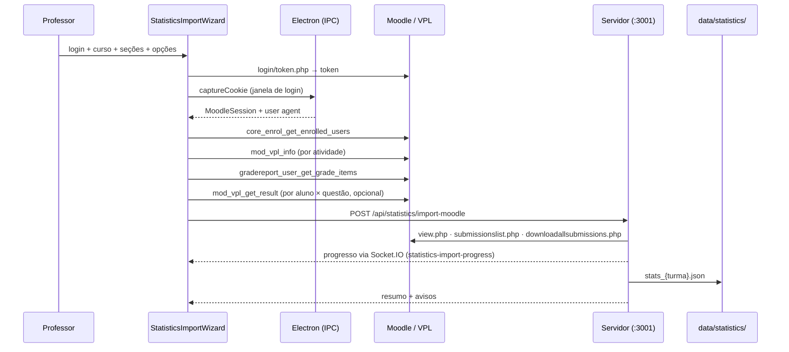

# Estatísticas da Turma

A aba **Estatísticas** transforma os dados do Moodle/VPL em evidências de engajamento, acerto e dificuldade, com alertas de alunos em risco, análises textuais geradas por IA e exportação em CSV para análise externa.

Ela é **independente da aba de Revisão**: tem a própria importação, o próprio dataset em disco e não altera notas nem arquivos de correção.

---

## 1. Visão geral do fluxo



O cliente coleta o que o **Web Service** permite; o servidor espelha as **páginas HTML do VPL** com a sessão do navegador. Cada fonte é opcional: se uma falhar, a importação continua e o motivo entra em `warnings`, exibido na tela.

**Várias seções por importação.** É possível marcar quantas seções do curso quiser: elas viram um único dataset, com as questões numeradas continuamente (`q1..qn`) e cada uma guardando de qual seção veio (campo `section`, exibido na aba Questões). O nome da turma é sugerido a partir da seleção (`Curso - P1 + P2`) e pode ser editado antes de importar. O formato antigo, de seção única, continua aceito pelo endpoint.

---

## 2. Dados coletados

| Fonte | Como | O que traz |
|-------|------|-----------|
| `core_enrol_get_enrolled_users` | Web Service | Alunos matriculados, e-mail, grupos, último acesso — inclusive quem **nunca entregou** |
| `mod_vpl_info` | Web Service | Enunciado, casos de teste (`vpl_evaluate.cases`), nota máxima, datas |
| `core_course_get_contents` | Web Service | Prazos (`dates[]`) de cada atividade |
| `gradereport_user_get_grade_items` | Web Service | Nota por atividade (fallback quando `mod_vpl_*` está bloqueado) |
| `mod_vpl_get_result` | Web Service (opcional) | Nota, **casos de teste reprovados** e **erros de compilação** por aluno |
| `mod/vpl/view.php` | Espelhamento (cookie) | Enunciado e casos de teste quando o WS não responde |
| `mod/vpl/views/submissionslist.php` | Espelhamento (cookie) | Data do envio, número de tentativas, nota, avaliação |
| `mod/vpl/views/downloadallsubmissions.php` | Espelhamento (cookie) | **Código-fonte** de cada aluno e o carimbo de data/hora da submissão |
| `mod/vpl/views/previoussubmissionslist.php` | Espelhamento (cookie, opcional) | Histórico completo de tentativas — mede persistência |

Os parsers de HTML são tolerantes: identificam as colunas pelo cabeçalho (PT/EN), caem em heurísticas quando não reconhecem e devolvem `null` em vez de derrubar a importação.

---

## 3. Seleção: uma ou várias turmas ao mesmo tempo

O seletor do topo é de **múltipla escolha**. Marcando mais de uma importação, `mergeDatasets` consolida tudo em um dataset único antes do cálculo — a tela inteira (visão geral, engajamento, questões, alunos, alertas, IA e exportação) passa a operar sobre o conjunto.

Três regras sustentam a consolidação:

| Regra | Por quê |
|-------|---------|
| **Chaves de questão prefixadas** (`{turma}::q1`) quando há mais de uma turma | O `q1` de uma turma sobrescreveria o da outra. Cada questão guarda `turma` e `sourceKey` (a chave original). Com uma turma só, as chaves ficam como antes — importações e relatórios antigos continuam válidos. |
| **Aluno unificado entre turmas** | O mesmo aluno pode aparecer em várias importações com metadados diferentes (uma com `userId` do Web Service, outra só com a pasta do ZIP). A identidade é resolvida por `userId` → e-mail → login → matrícula → pasta → nome, registrando todos os apelidos. O registro consolidado guarda `turmas[]`. |
| **Cada aluno responde só pelas questões das suas turmas** | Cobrar do aluno da turma A a questão da turma B faria toda questão parecer impossível e todo aluno parecer ausente. Por isso `expected` de uma questão conta apenas os alunos da turma dela, e o total esperado de entregas é a **soma das questões de cada aluno**, não `alunos × questões`. |

A visão combinada acrescenta:

- **`byTurma`** — a visão geral de cada turma calculada isoladamente, sem duplicar a regra de agregação (`computeMetrics` chama a si mesmo por turma). É o que alimenta a tabela **Comparação entre turmas** na aba Visão Geral.
- **Origem visível** — turma aparece nas abas Questões, Alunos e Alertas, e no detalhe de cada aluno.
- **Fontes parciais** — uma fonte só é marcada como "disponível" se existir em todas as turmas selecionadas; quando existe em parte delas, aparece como **parcial** (`sourcesPartial`).
- **Avisos prefixados** — cada aviso de coleta mostra de qual turma veio.

> Comparar turmas é seguro para taxa de entrega, atrasos e distribuição de risco. Média de nota só é comparável se as atividades forem equivalentes — as turmas normalmente têm questões diferentes. O subtítulo da tabela de comparação diz isso.

A seleção fica em `localStorage`, então o recorte sobrevive à troca de aba e ao reinício do app.

---

## 4. Ignorar alunos sem histórico

O Moodle costuma trazer cadastros que não têm nada a ver com a disciplina: matrícula cancelada, trancamento ou conta que nunca se inscreveu na matéria. Eles entram na lista de matriculados, nunca entregam nada e **puxam para baixo a taxa de entrega, inflam o índice de dificuldade e enchem os alertas de falsos críticos**.

O botão **Ignorar sem histórico** (persistido em `localStorage`) descarta esses cadastros de todas as métricas e de todas as exportações. O critério é conservador — um aluno é considerado **sem histórico** quando, em todas as questões das turmas dele, não existe:

- entrega registrada, nem
- nota (do VPL ou do livro de notas), nem
- tentativa, nem
- código-fonte capturado ou arquivos, nem
- saída de avaliação automática, nem
- histórico de tentativas.

Qualquer vestígio de atividade mantém o aluno na conta. Acesso ao curso **não** conta como histórico: entrar no Moodle sem nunca enviar exercício é justamente o sinal de risco que a tela quer mostrar.

A tela nunca esconde o efeito do filtro:

- uma faixa abaixo das abas informa quantos alunos ficaram de fora e permite listar os nomes (`metrics.excludedStudents`);
- o seletor de turmas mostra quantos cadastros sem histórico cada importação tem, antes de selecioná-la (`emptyStudentCount`);
- `overview.excludedStudents` viaja nas métricas e na coluna `students_ignored` do CSV `overview.csv`;
- o guia dentro do ZIP registra qual recorte gerou aquela exportação.

---

## 5. Métricas calculadas

`statistics.service.js` é uma função pura sobre os datasets salvos — recalcular é barato e importações antigas se beneficiam de regras novas.

### Por questão
Taxa de entrega, média/mediana/desvio das notas, taxa de aprovação, zeros, notas máximas, tentativas médias, taxa de erro de compilação, entregas atrasadas, histograma de notas, casos de teste que mais falharam, erros de compilação frequentes e uso de conceitos de C++.

**Índice de dificuldade** = `100 − (média × entregues / esperados)`. Quem não entregou conta como dificuldade — senão a questão que ninguém tentou pareceria fácil.

### Por aluno
Entregas, média, mediana, melhor/pior nota, tentativas, atrasos, erros de compilação, primeira/última submissão, conceitos usados, turmas de origem e o **score de risco**.

### Score de risco (0–100)

| Sinal | Peso |
|-------|------|
| Nenhuma entrega | 60 (crítico direto) |
| Questões sem entrega | até 45, proporcional |
| Média abaixo da aprovação (60%) | até 40, proporcional |
| Entregas atrasadas | até 10, proporcional |
| ≥ 8 tentativas sem atingir a média | 8 |

Faixas: **crítico** ≥ 60 · **alto** ≥ 40 · **médio** ≥ 20 · **ok** abaixo disso. Cada parcela devolve o motivo em texto, para que o alerta explique *por que* o aluno foi sinalizado.

### Engajamento
Submissões por hora, por dia da semana, matriz dia × hora, linha do tempo diária, antecedência em relação ao prazo (de "> 48h antes" a "após o prazo") e distribuição de tentativas.

### Cruzamento com a correção
Para cada turma selecionada, se existir uma turma de correção com o mesmo nome (`grades_turma_{turma}.json`), a tela compara a nota automática do VPL com a nota lançada pelo professor e destaca as maiores divergências.

---

## 6. Análises de IA

Quatro relatórios, gerados sob demanda e mantidos em cache (`stats_{turma}.reports.json`) para não gastar tokens a cada visita:

| Relatório | Contexto enviado ao modelo |
|-----------|---------------------------|
| **Diagnóstico geral** | Métricas agregadas (sem código) |
| **Análise da questão** | Enunciado, casos de teste, métricas e amostra de códigos (as piores notas + duas boas, para contraste) |
| **Diagnóstico individual** | Métricas do aluno, média da turma e seus códigos |
| **Plano de intervenção** | Lista de alunos sinalizados com motivos e números |

Os prompts usam o provedor definido em **Configurações** (Ollama, OpenAI, Gemini ou Claude) através de `ai.service.js`, compartilhado com a correção de código.

**O escopo faz parte da chave do cache.** Um diagnóstico de duas turmas juntas não é o diagnóstico de cada uma, então a chave é `{turmas ordenadas}##{kind}[:targetId]`. Relatórios de um recorte combinado ficam guardados no arquivo da primeira turma em ordem alfabética; chaves antigas (sem escopo) são interpretadas como pertencentes à turma do próprio arquivo, o que mantém visíveis os relatórios gerados antes desta versão. Cliente e servidor derivam a chave pela mesma regra (`reportKey` em `services/statistics.ts`).

---

## 7. Exportação em CSV

O botão **Exportar CSV** abre o catálogo de tabelas do recorte atual — cada uma com a contagem de linhas e colunas antes do download. Dá para levar **uma tabela isolada** (CSV único) ou **um pacote em ZIP** com as tabelas escolhidas.

O recorte exportado é exatamente o da tela: as turmas selecionadas e o filtro de alunos sem histórico.

### O que existe

**Transversais** — um retrato do momento:

| Arquivo | Tabela | Conteúdo |
|---------|--------|----------|
| `overview.csv` | Visão geral | Uma linha por turma da seleção (e uma linha combinada quando há mais de uma) com os indicadores agregados. |
| `questions.csv` | Questões | Uma linha por questão com dificuldade, dispersão das notas, tentativas, atrasos e erros de compilação. |
| `students.csv` | Alunos | Uma linha por aluno com entregas, notas, esforço, atrasos e o score de risco. |
| `submissions.csv` | Entregas (aluno × questão) | A tabela-fato: uma linha por par aluno × questão esperada, inclusive quando não houve entrega. |
| `risk_reasons.csv` | Composição do risco | Formato longo: uma linha por motivo que somou pontos no score de risco. |
| `question_failed_cases.csv` | Casos de teste reprovados | Contagem de reprovações por caso de teste, sem o limite de 8 da tela. |
| `question_compile_errors.csv` | Erros de compilação | Mensagens do compilador agrupadas por questão, com ocorrências. |
| `code_metrics.csv` | Métricas do código | Métricas estáticas de cada entrega com código, incluindo conceitos e práticas. |
| `concept_coverage.csv` | Conceitos por aluno | Percentual de alunos que usou cada construção de C++. |
| `question_concepts.csv` | Conceitos por questão | Formato longo: uso de cada conceito dentro de cada questão. |
| `code_smells.csv` | Práticas detectadas | Frequência de `using namespace std`, `goto`, variáveis globais, `system("pause")`. |
| `grade_histogram.csv` | Histogramas de nota | Faixas de 10% das médias por aluno e das notas de cada questão. |
| `professor_comparison.csv` | VPL × professor | Nota automática contra a nota lançada na aba de Revisão. |

**Séries temporais**:

| Arquivo | Tabela | Conteúdo |
|---------|--------|----------|
| `submission_events.csv` | Eventos de envio | Espinha temporal: uma linha por envio (cada tentativa, quando o histórico completo foi importado). |
| `timeline_daily.csv` | Série diária por turma | Envios por dia, alunos ativos no dia e acumulado. |
| `student_daily_activity.csv` | Atividade diária por aluno | Dados em painel (aluno × dia) — mede regularidade e abandono. |
| `question_timeline.csv` | Série diária por questão | Envios por dia com a distância até o prazo. |
| `activity_by_hour.csv` | Envios por hora | 24 linhas por turma, inclusive as horas com zero. |
| `activity_by_weekday.csv` | Envios por dia da semana | 7 linhas por turma. |
| `activity_heatmap.csv` | Matriz dia × hora | 168 linhas por turma, formato longo para `pivot`. |
| `lead_time.csv` | Antecedência das entregas | Faixas de antecedência, questão por questão. |

**Unificados** — tabelas largas, prontas para abrir em um notebook sem nenhum `merge`:

| Arquivo | Tabela | Conteúdo |
|---------|--------|----------|
| `unified_submissions.csv` | Entregas desnormalizadas | Cada entrega esperada com atributos do aluno, da questão, do tempo e do código na mesma linha. |
| `unified_students.csv` | Perfil do aluno | Desempenho, risco, hábitos de horário (madrugada, fim de semana, antecedência) e conceitos dominados. |
| `unified_events.csv` | Eventos enriquecidos | Cada envio no tempo com o perfil do aluno e as características da questão. |
| `students_wide.csv` | Planilha de notas | Alunos × questões, quatro colunas por questão (nota, entrega, tentativas, atraso). |

### Convenções dos arquivos

- UTF-8 **sem BOM**, separador vírgula, ponto decimal — `pd.read_csv` sem parâmetros extras.
- Célula vazia = dado ausente (`NaN`). Vazio em `percent` é "sem nota", diferente de nota 0.
- Booleanos como `True`/`False`; listas em uma célula separadas por ` | `.
- Datas em ISO 8601 no **fuso local** da máquina que exportou, com `*_epoch` em milissegundos (UTC) ao lado. Hora, dia da semana e mapa de calor seguem o mesmo fuso.
- Chaves de junção: `student_key`, `question_key` e `turma`.
- Uma linha por observação. A única tabela com linha de total é `overview.csv`, onde `scope = "__combinado__"`.

### Markdown que acompanha o ZIP

Por padrão o ZIP leva dois arquivos gerados a partir das mesmas definições das tabelas — documentação e dado não têm como divergir:

- **`LEIA-ME.md`** — o recorte exportado, as convenções, os primeiros comandos em pandas e onze receitas de análise (análise de itens e índice de discriminação, correlação entre questões, esforço × resultado, procrastinação, ritmo da turma no tempo, hábitos de horário, regularidade e abandono, validação do score de risco, comparação entre turmas, conceitos de C++, clusterização de perfis), fechando com oito cuidados de interpretação.
- **`DICIONARIO-DE-DADOS.md`** — o significado de cada coluna de cada tabela, o grão (quantas linhas, quantas colunas) e um glossário dos conceitos que aparecem em várias tabelas (nota percentual, aprovação, índice de dificuldade, score de risco, aluno sem histórico, tentativa).

O ZIP fica assim:

```
estatisticas_{turmas}_{AAAAMMDD-HHMM}.zip
├── LEIA-ME.md
├── DICIONARIO-DE-DADOS.md
└── csv/
    ├── overview.csv
    ├── submissions.csv
    └── ...
```

---

## 8. Arquivos

### Backend — `server/src/features/statistics/`
| Arquivo | Responsabilidade |
|---------|------------------|
| `statistics.routes.js` | Rotas REST |
| `statistics.controller.js` | Importação, consulta, exportação e geração de relatórios |
| `statistics.service.js` | Consolidação de datasets e motor de métricas (função pura) |
| `statistics.export.js` | Catálogo de tabelas, CSV, ZIP e os markdowns de apoio |
| `statistics.prompts.js` | Montagem dos prompts pedagógicos |
| `moodleHarvester.js` | Sessão HTTP autenticada e parsers das páginas do VPL |
| `codeMetrics.js` | Métricas estáticas do código C++ |
| `statistics.paths.js` | Caminhos da turma e a lista de arquivos-irmão |

### Backend — `server/src/features/learning/`
| Arquivo | Responsabilidade |
|---------|------------------|
| `learning.routes.js` / `learning.controller.js` | Rotas e handlers do submódulo |
| `taxonomy.service.js` | Taxonomias globais, vínculo por turma e herança por `cmid` |
| `topics.service.js` | Domínio conceitual por aluno e por conceito |
| `moodleActivity.js` | Coleta e agregação dos relatórios de log e participação |
| `indicators.service.js` | As cinco dimensões, com `n` e motivo de ausência |
| `patterns.service.js` | Os sete padrões de comportamento |
| `academic.service.js` | Casamento da planilha do portal por matrícula |
| `outcome.service.js` | Resolve o desfecho por aluno |
| `correlation.js` | Postos médios, Spearman, delta de Cliff, bootstrap com semente |
| `association.service.js` | Famílias, cobertura, janela de início, as recusas |
| `interventions.service.js` | Registro com retrato e grupo de comparação |
| `consolidation.service.js` | O `.zip` autodescrito |
| `learning.prompts.js` | Prompt da sugestão de mapeamento |

### Rotas
| Método | Rota | Função |
|--------|------|--------|
| POST | `/api/statistics/import-moodle` | Coleta e consolida o dataset |
| GET | `/api/statistics/datasets` | Lista importações salvas (com a contagem de alunos sem histórico) |
| GET | `/api/statistics/dataset?turmas=&ignoreEmpty=` | Métricas calculadas do recorte |
| GET | `/api/statistics/submission-code?turmas=&userId=&question=` | Código e avaliação de uma submissão |
| DELETE | `/api/statistics/dataset/:turma` | Remove importação e relatórios |
| GET | `/api/statistics/export/manifest?turmas=&ignoreEmpty=` | Catálogo de tabelas com contagem de linhas |
| GET | `/api/statistics/export?turmas=&tables=&bundle=csv\|zip&docs=` | CSV único ou ZIP |
| GET | `/api/statistics/ai-reports?turmas=` | Relatórios em cache das turmas selecionadas |
| POST | `/api/statistics/ai-report` | Gera um relatório para o recorte |

A seleção de turmas viaja como **JSON** (`turmas=["A","B"]`) porque nome de turma pode conter vírgula; o endpoint também aceita `turma=` único, mantendo compatibilidade.

### Frontend
| Arquivo | Responsabilidade |
|---------|------------------|
| `pages/StatisticsPage.tsx` | Orquestra os dois grupos e suas sub-abas, a seleção de turmas, o filtro e a exportação |
| `hooks/useStatistics.ts` | Estado: importações, seleção, filtro, métricas e relatórios |
| `components/statistics/StatisticsImportWizard.tsx` | Assistente de importação com log da coleta |
| `components/statistics/DatasetSelector.tsx` | Seletor de importações com múltipla escolha |
| `components/statistics/StatisticsExportPanel.tsx` | Catálogo de exportação (CSV único ou ZIP) |
| `components/statistics/TurmaComparison.tsx` | Tabela e gráfico de comparação entre turmas |
| `components/statistics/{Overview,Engagement,Questions,Students,Alerts,AIInsights}Panel.tsx` | Sub-abas |
| `components/statistics/charts/` | Gráficos SVG próprios (sem biblioteca externa) |
| `services/statistics.ts` | Cliente REST, chave de cache dos relatórios e download de blobs |
| `components/learning/ConceptsPanel.tsx` | Sub-aba Conceitos, com o mapeamento questão→conceito |
| `components/learning/IndicatorsPanel.tsx` | Sub-aba Indicadores: dimensões, indicadores crus e curva de aprendizagem |
| `components/learning/PatternsPanel.tsx` | Sub-aba Padrões: um cartão por padrão, com interpretação e intervenção |
| `components/learning/LearningSourcesBar.tsx` | O que está medido e o botão de coleta de logs |
| `components/learning/ValidationPanel.tsx` | Sub-aba Validação, com os três blocos e a dispersão |
| `components/learning/AcademicImportModal.tsx` | Leitura da planilha, mapeamento e prévia do casamento |
| `components/learning/InterventionsPanel.tsx` | Registro e acompanhamento |
| `components/learning/SocraticPackageModal.tsx` | Geração e download do `.md` |
| `hooks/useLearning.ts` · `hooks/useLearningInsights.ts` · `hooks/useValidation.ts` | Estado do submódulo |
| `services/learning.ts` | Cliente REST do submódulo |

### Dados em disco
```
data/
├── taxonomy.json                     # taxonomias de conceitos, reutilizáveis entre turmas
└── statistics/
    ├── stats_{turma}.json            # dataset bruto (alunos, questões, código, métricas)
    ├── stats_{turma}.reports.json    # relatórios de IA em cache
    ├── stats_{turma}.taxonomy.json   # vínculo e mapeamento questão→conceito
    ├── stats_{turma}.activity.json   # atividade agregada por aluno e dia
    ├── stats_{turma}.academic.json   # notas e frequência do portal, já casadas
    ├── stats_{turma}.outcome.json    # definição do desfecho e marcações manuais
    └── stats_{turma}.interventions.json  # intervenções com o retrato de baseline
```

Nada da seleção, do filtro ou da exportação é persistido no dataset: são leituras derivadas, calculadas a cada requisição.

---

## 9. Gráficos

Os gráficos são SVG escritos no próprio projeto — nenhuma dependência nova, o que mantém o pacote do Electron enxuto e o app funcional offline.

A paleta vive em `index.css` como custom properties `--viz-*`, com um passo para cada tema. Os valores foram validados para as superfícies reais do app (`#ffffff` e `#171717`) quanto a banda de luminosidade, piso de croma, separação para daltonismo e contraste — **a ordem dos slots é o mecanismo de segurança**, então trocar os hexadecimais exige revalidar.

Regras aplicadas em todos os gráficos:

- Barras com no máximo 24px de espessura, ponta de dado arredondada em 4px e base reta.
- Vão de 2px na cor da superfície separando marcas encostadas; anel de 2px em pontos que se sobrepõem.
- Grade em traço fino e sólido, sempre recessiva.
- Legenda presente a partir de duas séries; uma série é nomeada pelo título.
- Texto nunca veste a cor da série — a identidade vem da marca colorida ao lado.
- Cores de estado (crítico/alto/médio/ok) sempre acompanhadas de ícone e rótulo.
- Rótulos são medidos antes de desenhar e reticenciados; nunca são cortados pela própria marca.
- Magnitude contínua (mapa de calor) usa rampa sequencial de uma matiz só.

---

## 7. Análises de Aprendizado (submódulo)

A aba Estatísticas tem dois níveis: **Dados** (as seis sub-abas descritas acima) e **Aprendizado**, que une as propostas institucionais de analytics do Moodle, de tutoria socrática por LLM e de base longitudinal para predição.

A Fase 1 entrega a sub-aba **Conceitos**: sem mapear questão a conceito, os dados por questão produzem notas; com o mapeamento, produzem um perfil de domínio conceitual — que é o que torna o alerta acionável.

A Fase 2 entrega as sub-abas **Indicadores** e **Padrões**, mais a coleta dos logs do Moodle: o domínio conceitual diz *em qual conceito* o aluno tem lacuna, e os indicadores dizem *como ele estuda*.

As Fases 3 e 4 fecham o ciclo: **Validação** confronta os indicadores com um desfecho real, **Intervenções** registra o que o professor fez depois do alerta, e **Exportação** consolida tudo numa base longitudinal autodescrita.

### Taxonomia: global, mapeamento por turma

| Onde | O quê |
|------|-------|
| `data/taxonomy.json` | Taxonomias por disciplina (conceitos), reutilizáveis entre turmas. Semente AL01–AL09 criada no primeiro boot |
| `data/statistics/stats_{turma}.taxonomy.json` | Vínculo turma→taxonomia e o mapeamento `questão → [{conceito, peso}]` |

O peso tem só dois valores — **principal (1)** e **secundário (0,5)**. Um campo numérico livre daria falsa precisão.

Ao vincular uma taxonomia, o mapeamento é **pré-preenchido a partir de outras turmas que já mapearam a mesma atividade VPL** (mesmo `cmid`). A mesma prova reaparece a cada semestre, e sem isso o professor remapearia tudo em cada importação — o gargalo que a proposta de analytics prevê.

### `codeSignals`: o cruzamento que separa dois problemas

Cada conceito pode apontar para chaves do detector estático de `codeMetrics.js` (`loops`, `arrays`, `stdVector`, …). Isso permite distinguir dois casos que a nota sozinha confunde:

| Nota baixa e… | Leitura | Intervenção |
|---|---|---|
| a construção nem aparece no código | não chegou a tentar usar | ensinar o conceito |
| a construção aparece | tentou e errou | depurar o uso |

Conceito sem sinal confiável fica com a lista vazia e o cruzamento simplesmente não aparece. Busca e Ordenação não têm detector; Matrizes fica de fora porque o detector não distingue vetor de matriz — forçar o vínculo produziria evidência falsa.

### Domínio conceitual, e o que ele se recusa a afirmar

Domínio do aluno no conceito = média das notas percentuais das questões do conceito, ponderada pelo peso. Faixas: **dominado** ≥ 80, **parcial** ≥ 60, **lacuna** abaixo disso.

Com 2–4 questões por conceito o número é grosseiro, então o cálculo se recusa a fingir precisão:

- Menos de **duas** questões avaliadas → **"evidência insuficiente"**, nunca 0%. Ausência de medida não é desempenho ruim.
- Aluno sem nenhuma entrega cai em evidência insuficiente, **não em lacuna** — a falta de entrega já é sinalizada pelos alertas da aba Dados; tratá-la como lacuna conceitual inventaria evidência.
- Conceito sem evidência **não entra nos gráficos**; aparece nomeado em nota de rodapé.
- A matriz aluno × conceito codifica a **lacuna** (100 − domínio) numa escala fixa de 0 a 100, com célula hachurada para "sem evidência" e marcador para "não chegou a usar a construção".

### Sugestão por IA

`POST /api/learning/taxonomy/suggest` envia por questão o enunciado, os casos de teste e as construções que os alunos realmente usaram (o `conceptUsage` que as estatísticas já calculam) e devolve uma proposta de mapeamento. A sugestão **não é persistida**: volta para a tela de revisão, cada vínculo com a justificativa da IA ao lado, e só entra quando o professor aceita. JSON inválido do modelo vira mensagem de erro, não fallback silencioso.

### Coleta de atividade (logs do Moodle)

O VPL diz o que o aluno entregou; os logs dizem se ele apareceu. Sem eles, engajamento e regularidade viram proxy de entrega — que é outra coisa. A coleta é uma **ação avulsa** no cabeçalho do grupo Aprendizado (funciona em turmas já importadas), usando a mesma sessão por cookie do espelhamento do VPL.

Duas fontes, ambas opcionais e tolerantes a falha:

- `/report/log/index.php?…&download=csv` — o relatório de logs, lido por um parser de CSV próprio (aspas, vírgula e ponto e vírgula dentro de campo, cabeçalho em português ou inglês). Cabeçalho irreconhecível, HTML no lugar do CSV, arquivo vazio ou 403 viram **aviso**, nunca exceção.
- `/report/participation/index.php` — quais alunos abriram cada VPL. Recusa em todas as atividades vira um aviso único, porque "participação: não" sem motivo é pior que o erro.

**Agrega na coleta, nunca guarda o evento bruto.** O relatório de uma turma tem dezenas de milhares de linhas; o que se persiste é `aluno × dia → contagem`, mais primeiro e último acesso e as atividades vistas. No dataset de teste, 180 linhas de log viraram 1,7 KB.

> **"Tempo de estudo" não existe.** O Moodle registra eventos com carimbo de hora, não duração de sessão. A interface fala em *dias com atividade* e *eventos*, que é o que o dado sustenta.

### Cinco dimensões, e o que significa um indicador ausente

| Dimensão | Indicadores | Depende de |
|---|---|---|
| **Engajamento** | dias com atividade · eventos por semana · atividades acessadas · taxa de entrega | logs (os três primeiros) |
| **Regularidade** | intervalo mediano entre dias ativos · maior período de silêncio · semanas com atividade | logs, com recuo para as datas de entrega |
| **Persistência** | tentativas até passar · ganho da primeira à última tentativa · recuperação · questões abandonadas | `history[]` (só com histórico profundo) |
| **Aprendizagem** | domínio médio nos conceitos · conceitos em lacuna · acerto na primeira tentativa | taxonomia da Fase 1 |
| **Autorregulação** | antecedência mediana ao prazo · entregas na última hora · prática fora da véspera | prazos cadastrados |

Cada indicador carrega `value`, `n`, `available` e o `reason` quando falta. **Ausência de medida nunca vira zero**: aluno sem entrega não tem antecedência nem ganho — isso é `null`, e dimensão sem nenhum indicador disponível fica indisponível, não zerada.

O `reason` **sobrevive ao valor presente** quando a medida veio de uma fonte mais pobre. "Dias com atividade" tirado das datas de entrega, porque não há logs, aparece com a ressalva ao lado do rótulo: o número existe, mas não é o número que o rótulo promete.

**Mediana, não média**, para intervalos e antecedência: um aluno que sumiu 40 dias destrói a média e não move a mediana.

**O score por dimensão é posição relativa na turma**, não nota absoluta — cada indicador vira percentil e a dimensão é a média dos disponíveis. A tela diz isso, e a barra usa **cor única**: verde/âmbar/vermelho sobre um percentil pintaria o aluno mediano de "atenção" e criaria um penhasco entre o 34 e o 32, quando o que a barra mostra é ordenação.

### Sete padrões de comportamento

| Código | Regra |
|---|---|
| `lowEngagementEarly` | nenhuma atividade nas duas primeiras semanas do período |
| `irregularPlusConceptGap` | silêncio longo (quartil superior da turma) **e** ao menos um conceito em lacuna |
| `procrastination` | antecedência mediana abaixo de 6 h, em duas ou mais entregas |
| `bruteForce` | 3+ tentativas, ganho abaixo do limiar, nunca passou |
| `recurringConceptError` | mesmo conceito em lacuna em 2+ questões, ou o mesmo caso de teste reprovado repetidamente |
| `productivePersistence` | 3+ tentativas **com** ganho acima do limiar — **não é risco, é reconhecimento** |
| `earlyAbandonment` | 2+ questões com poucas tentativas, abandonadas sem passar |

**Mínimo de 3 tentativas para classificar trajetória.** Com dois pontos não há tendência, há um segmento de reta. E nada de regressão linear sobre 3 pontos: as quantidades são primeira nota, última nota, ganho e "chegou a passar", que são interpretáveis.

**O limiar de ganho relevante sai da mediana da própria turma**, com piso de 20 p.p., e aparece na tela. O piso não é decoração: com a mediana de uma turma estagnada em 10 p.p., um aluno que foi de 20% a 30% em cinco tentativas sem nunca passar seria lido como persistente produtivo — o contrário do que aconteceu.

Padrão cuja fonte está ausente aparece como **"não avaliável"**, nomeando o que falta — nunca como "nenhum aluno", que afirmaria algo não medido.

### A correção do score de risco

O `computeRisk` somava 8 pontos para "8+ tentativas com média baixa". A proposta de analytics diz o oposto: muitas tentativas **com melhoria** é persistência produtiva. O app penalizava exatamente o aluno que estava fazendo a coisa certa.

A parcela agora só soma quando `improving !== true`, e `improving` usa o mesmo piso de 20 p.p. do detector de padrões — se os dois discordassem, a tela marcaria "persistência produtiva" num aluno que a lista de alertas ainda penaliza.

Com `improving === null` (turma sem histórico profundo) **a regra anterior continua valendo**: nenhuma importação existente muda de comportamento. `productivePersistence` é um campo próprio do aluno, exibido como reconhecimento; não entra em `risk.reasons`, que é lista de motivos de risco.

### Validação — o que impede o número bonito e errado

Sem um desfecho, os indicadores são plausíveis, não validados. A sub-aba Validação associa cada indicador a um resultado real, com quatro travas:

**Circularidade.** Metade dos indicadores sai das mesmas notas do VPL que compõem o desfecho. Eles aparecem em **três blocos separados** — comportamento, processo, compartilham origem — e **nunca numa lista única ordenada**, em que o domínio conceitual sempre ficaria no topo e seria lido como a descoberta do semestre quando é aritmética. Com a nota do portal e o peso do VPL desconhecido, o bloco de processo inteiro é promovido a "compartilha origem": contaminação desconhecida se trata como contaminação.

**A medida.** Spearman com **postos médios** — o atalho `1 − 6Σd²/(n(n²−1))` só vale sem empate, e aqui `stalledCount` é 0 para quase toda a turma. Para desfecho binário, **delta de Cliff**, porque contra um 0/1 a magnitude do Spearman é limitada pela proporção dos grupos e comparar entre indicadores passaria a comparar atenuação em vez de associação.

**A incerteza.** Intervalo por bootstrap dos pares, **reranqueando dentro de cada réplica** (reamostrar os postos fixaria as marginais e devolveria um intervalo estreito e falso), com semente determinística — intervalo que muda a cada recarga destrói a confiança mais rápido que intervalo largo. Sem p-valor, e a leitura é a **largura** do intervalo, nunca se ele cruza o zero: "o IC não cruza zero" é um p-valor pela porta dos fundos.

**As recusas.** Abaixo de 15 pares, indicador constante, mais de 90% da turma no mesmo valor, cobertura abaixo de 34% — cada caso aparece com o motivo, com o mesmo peso visual de um número. Indicador ausente para todos tem motivo próprio em vez de virar "medido em poucos alunos".

> **Evasão sobre o período inteiro é tautológica.** Quem saiu na terceira semana tem poucos dias ativos *porque* saiu. O cálculo recusa e exige a janela **início do período**, que recorta submissões, histórico e atividade até o primeiro terço e recalcula indicadores e domínio sobre o recorte. É também a pergunta que interessa: o que dava para saber cedo.

### Planilha do portal

O PortalHelper ainda entrega dados simulados, então a fonte é a planilha que o professor baixa do portal. Ela é lida no renderer com o `xlsx` (dependência do cliente) e chega ao servidor já normalizada — o mesmo caminho do `importGrades`.

A chave é a **matrícula**, comparada sem zeros à esquerda: planilha aberta no Excel transforma matrícula em número, e sem normalizar o casamento daria zero sem ninguém perceber. A prévia é obrigatória e mostra quem casou por qual campo, as linhas sem aluno e os alunos sem linha.

### Intervenções — acompanhamento, não avaliação de efeito

Cada registro guarda um **retrato** dos indicadores no momento (um por importação, compartilhado entre as intervenções daquela leva). Sem ele não há o que comparar, porque o dataset é sobrescrito a cada reimportação.

Quando a turma é reimportada, a tela mostra a evolução de quem recebeu ao lado da evolução de quem estava **no mesmo terço da distribuição** e não recebeu. O aviso de regressão à média fica sempre visível, o grupo de comparação não é sorteado, e a palavra "efeito" não aparece.

### Pacote socrático

As regras negativas da proposta de tutoria — não dar a resposta, exigir tentativa antes da dica, uma pergunta por vez, não confirmar solução incompleta — são **texto fixo que não passa pelo modelo**. Se a IA pudesse reescrevê-las, o pacote deixaria de ser socrático no primeiro prompt em que o modelo achasse mais gentil entregar a resposta. O que ela gera é o diagnóstico provável e as perguntas-guia para aquele erro.

### A base consolidada

Cada projeto tem um terço do mesmo aluno: este app tem o comportamento e o conceito, o portal tem a nota e a frequência, a tutoria tem a intervenção. A chave de junção é a matrícula.

Como o PortalHelper não tem schema, o pacote é **autodescrito** — quem o ler não precisa combinar formato antes. Um `.zip` (via `adm-zip`, já dependência) com:

| Arquivo | Grão |
|---|---|
| `alunos.csv` | turma × aluno — 17 indicadores, 5 escores, desfecho, flags de fonte |
| `conceitos.csv` | turma × aluno × conceito |
| `trajetorias.csv` | turma × aluno × questão × tentativa |
| `atividade_diaria.csv` | turma × aluno × dia |
| `intervencoes.csv` | uma por intervenção, com o antes e o depois |
| `turmas.csv` | uma por turma, com as fontes presentes |
| `dicionario.csv` | coluna, tipo, família, fonte, unidade, quando fica vazia, observação |
| `LEIA-ME.md` · `manifesto.json` | as cinco armadilhas e a procedência |

Decisões que fazem o pacote servir para o que promete:

- **A declaração das colunas é única** (`TABLES` em `consolidation.service.js`) e serve tanto para escrever o CSV quanto para gerar o dicionário. Duas listas separadas fariam o dicionário mentir no primeiro campo novo — pior que não ter dicionário.
- **Célula vazia, nunca zero.** Mesma regra das fases anteriores, e também o que um modelo de árvore quer: o XGBoost trata ausente nativamente, e um zero imputado vira ponto de corte real.
- **A coluna `familia`** marca cada campo como `identificacao | comportamento | desempenho | desfecho | contexto` — é o que impede treinar um modelo com a nota dentro das features e comemorar a acurácia.
- **A coluna `observacao`** marca os indicadores que caem para um substituto sem logs: sem ela, "dias com atividade" tirado das datas de entrega passaria por medida de log dentro do CSV.
- **Formato longo** onde o conjunto varia (conceitos, questões); largo só em `alunos.csv`.
- **Pseudonimização por padrão**, com sal em `{DATA_DIR}/export-salt.txt`, fora do pacote. O mesmo aluno mantém o mesmo id entre exportações — a ligação longitudinal sobrevive — sem que o id volte a ser matrícula.

### Rotas

| Método | Rota | Função |
|--------|------|--------|
| GET | `/api/learning/taxonomies` | Taxonomias globais |
| POST | `/api/learning/taxonomies` | Cria ou atualiza uma taxonomia |
| DELETE | `/api/learning/taxonomies/:id` | Remove uma taxonomia |
| GET | `/api/learning/taxonomy?turma=` | Vínculo e mapeamento da turma |
| POST | `/api/learning/taxonomy` | Salva o mapeamento |
| POST | `/api/learning/taxonomy/bind` | Vincula a taxonomia e herda o mapeamento por `cmid` |
| POST | `/api/learning/taxonomy/suggest` | Sugestão por IA (não persiste) |
| GET | `/api/learning/mastery?turma=` | Domínio conceitual calculado |
| GET | `/api/learning/activity?turma=` | Resumo do que foi coletado (e a origem para reabrir o Moodle) |
| POST | `/api/learning/activity/collect` | Coleta logs e participação (progresso via Socket.IO) |
| GET | `/api/learning/indicators?turma=` | Cinco dimensões por aluno |
| GET | `/api/learning/patterns?turma=` | Padrões detectados, com os limiares em uso |
| GET / POST | `/api/learning/academic` | Planilha do portal (`POST /academic/preview` confere antes) |
| GET / POST | `/api/learning/outcome` | Definição do desfecho |
| GET | `/api/learning/association?turma=&window=` | Associação indicador × desfecho |
| GET / POST | `/api/learning/interventions` | Registro com retrato e acompanhamento |
| PATCH / DELETE | `/api/learning/interventions/:id` | Situação, anotação, remoção |
| POST | `/api/learning/socratic` | Pacote socrático |
| GET | `/api/learning/export/turmas` | Turmas disponíveis para a base |
| POST | `/api/learning/export` | Devolve o `.zip` consolidado |

### Arquivos-irmão do dataset

`statistics.paths.js` centraliza os caminhos de uma turma e a lista `SIDECAR_SUFFIXES` (hoje `.reports.json`, `.taxonomy.json`, `.activity.json`, `.academic.json`, `.outcome.json` e `.interventions.json`). **Quem criar um arquivo-irmão novo precisa registrá-lo ali** — é o que impede dois erros: o arquivo aparecer na listagem como se fosse uma importação, e sobrar órfão quando a turma é apagada.

### Nomenclatura

`concept` já designa, no módulo de Estatísticas, os sinais estáticos do parser de C++. O conceito curricular chama-se **`topic`** no código. Na interface os dois aparecem como "conceito" (curricular) e "construção" (linguagem).
