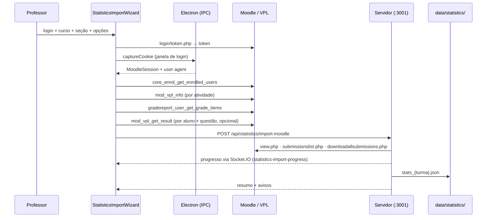

# Estatísticas da Turma

A aba **Estatísticas** transforma os dados do Moodle/VPL em evidências de engajamento, acerto e dificuldade, com alertas de alunos em risco e análises textuais geradas por IA.

Ela é **independente da aba de Revisão**: tem a própria importação, o próprio dataset em disco e não altera notas nem arquivos de correção.

---

## 1. Visão geral do fluxo



O cliente coleta o que o **Web Service** permite; o servidor espelha as **páginas HTML do VPL** com a sessão do navegador. Cada fonte é opcional: se uma falhar, a importação continua e o motivo entra em `warnings`, exibido na tela.

---

## 2. Dados coletados

| Fonte | Como | O que traz |
|-------|------|-----------|
| `core_enrol_get_enrolled_users` | Web Service | Alunos matriculados, e-mail, grupos, último acesso — inclusive quem **nunca entregou** |
| `mod_vpl_info` | Web Service | Enunciado, casos de teste (`vpl_evaluate.cases`), nota máxima, datas |
| `core_course_get_contents` | Web Service | Prazos (`dates[]`) de cada atividade |
| `gradereport_user_get_grade_items` | Web Service | Nota por atividade (fallback quando `mod_vpl_*` está bloqueado) |
| `mod_vpl_get_result` | Web Service (opcional) | Nota, **casos de teste reprovados** e **erros de compilação** por aluno |
| `mod/vpl/view.php` | Espelhamento (cookie) | Enunciado e casos de teste quando o WS não responde |
| `mod/vpl/views/submissionslist.php` | Espelhamento (cookie) | Data do envio, número de tentativas, nota, avaliação |
| `mod/vpl/views/downloadallsubmissions.php` | Espelhamento (cookie) | **Código-fonte** de cada aluno e o carimbo de data/hora da submissão |
| `mod/vpl/views/previoussubmissionslist.php` | Espelhamento (cookie, opcional) | Histórico completo de tentativas — mede persistência |

Os parsers de HTML são tolerantes: identificam as colunas pelo cabeçalho (PT/EN), caem em heurísticas quando não reconhecem e devolvem `null` em vez de derrubar a importação.

---

## 3. Métricas calculadas

`statistics.service.js` é uma função pura sobre o dataset salvo — recalcular é barato e importações antigas se beneficiam de regras novas.

### Por questão
Taxa de entrega, média/mediana/desvio das notas, taxa de aprovação, zeros, notas máximas, tentativas médias, taxa de erro de compilação, entregas atrasadas, histograma de notas, casos de teste que mais falharam, erros de compilação frequentes e uso de conceitos de C++.

**Índice de dificuldade** = `100 − (média × entregues / matriculados)`. Quem não entregou conta como dificuldade — senão a questão que ninguém tentou pareceria fácil.

### Por aluno
Entregas, média, melhor/pior nota, tentativas, atrasos, erros de compilação, primeira/última submissão, conceitos usados e o **score de risco**.

### Score de risco (0–100)

| Sinal | Peso |
|-------|------|
| Nenhuma entrega | 60 (crítico direto) |
| Questões sem entrega | até 45, proporcional |
| Média abaixo da aprovação (60%) | até 40, proporcional |
| Entregas atrasadas | até 10, proporcional |
| ≥ 8 tentativas sem atingir a média | 8 |

Faixas: **crítico** ≥ 60 · **alto** ≥ 40 · **médio** ≥ 20 · **ok** abaixo disso. Cada parcela devolve o motivo em texto, para que o alerta explique *por que* o aluno foi sinalizado.

### Engajamento
Submissões por hora, por dia da semana, matriz dia × hora, linha do tempo diária, antecedência em relação ao prazo (de "> 48h antes" a "após o prazo") e distribuição de tentativas.

### Cruzamento com a correção
Se existir uma turma de correção com o mesmo nome (`grades_turma_{turma}.json`), a tela compara a nota automática do VPL com a nota lançada pelo professor e destaca as maiores divergências.

---

## 4. Análises de IA

Quatro relatórios, gerados sob demanda e mantidos em cache (`stats_{turma}.reports.json`) para não gastar tokens a cada visita:

| Relatório | Contexto enviado ao modelo |
|-----------|---------------------------|
| **Diagnóstico geral** | Métricas agregadas (sem código) |
| **Análise da questão** | Enunciado, casos de teste, métricas e amostra de códigos (as piores notas + duas boas, para contraste) |
| **Diagnóstico individual** | Métricas do aluno, média da turma e seus códigos |
| **Plano de intervenção** | Lista de alunos sinalizados com motivos e números |

Os prompts usam o provedor definido em **Configurações** (Ollama, OpenAI, Gemini ou Claude) através de `ai.service.js`, compartilhado com a correção de código.

---

## 5. Arquivos

### Backend — `server/src/features/statistics/`
| Arquivo | Responsabilidade |
|---------|------------------|
| `statistics.routes.js` | Rotas REST |
| `statistics.controller.js` | Importação, consulta e geração de relatórios |
| `statistics.service.js` | Motor de métricas (função pura) |
| `statistics.prompts.js` | Montagem dos prompts pedagógicos |
| `moodleHarvester.js` | Sessão HTTP autenticada e parsers das páginas do VPL |
| `codeMetrics.js` | Métricas estáticas do código C++ |

### Rotas
| Método | Rota | Função |
|--------|------|--------|
| POST | `/api/statistics/import-moodle` | Coleta e consolida o dataset |
| GET | `/api/statistics/datasets` | Lista importações salvas |
| GET | `/api/statistics/dataset?turma=` | Métricas calculadas |
| GET | `/api/statistics/submission-code` | Código e avaliação de uma submissão |
| DELETE | `/api/statistics/dataset/:turma` | Remove importação e relatórios |
| GET | `/api/statistics/ai-reports?turma=` | Relatórios em cache |
| POST | `/api/statistics/ai-report` | Gera um relatório |

### Frontend
| Arquivo | Responsabilidade |
|---------|------------------|
| `pages/StatisticsPage.tsx` | Orquestra as seis sub-abas |
| `hooks/useStatistics.ts` | Estado: datasets, métricas e relatórios |
| `components/statistics/StatisticsImportWizard.tsx` | Assistente de importação com log da coleta |
| `components/statistics/{Overview,Engagement,Questions,Students,Alerts,AIInsights}Panel.tsx` | Sub-abas |
| `components/statistics/charts/` | Gráficos SVG próprios (sem biblioteca externa) |
| `services/statistics.ts` | Cliente REST |

### Dados em disco
```
data/statistics/
├── stats_{turma}.json           # dataset bruto (alunos, questões, código, métricas)
└── stats_{turma}.reports.json   # relatórios de IA em cache
```

---

## 6. Gráficos

Os gráficos são SVG escritos no próprio projeto — nenhuma dependência nova, o que mantém o pacote do Electron enxuto e o app funcional offline.

A paleta vive em `index.css` como custom properties `--viz-*`, com um passo para cada tema. Os valores foram validados para as superfícies reais do app (`#ffffff` e `#171717`) quanto a banda de luminosidade, piso de croma, separação para daltonismo e contraste — **a ordem dos slots é o mecanismo de segurança**, então trocar os hexadecimais exige revalidar.

Regras aplicadas em todos os gráficos:

- Barras com no máximo 24px de espessura, ponta de dado arredondada em 4px e base reta.
- Vão de 2px na cor da superfície separando marcas encostadas; anel de 2px em pontos que se sobrepõem.
- Grade em traço fino e sólido, sempre recessiva.
- Legenda presente a partir de duas séries; uma série é nomeada pelo título.
- Texto nunca veste a cor da série — a identidade vem da marca colorida ao lado.
- Cores de estado (crítico/alto/médio/ok) sempre acompanhadas de ícone e rótulo.
- Rótulos são medidos antes de desenhar e reticenciados; nunca são cortados pela própria marca.
- Magnitude contínua (mapa de calor) usa rampa sequencial de uma matiz só.
