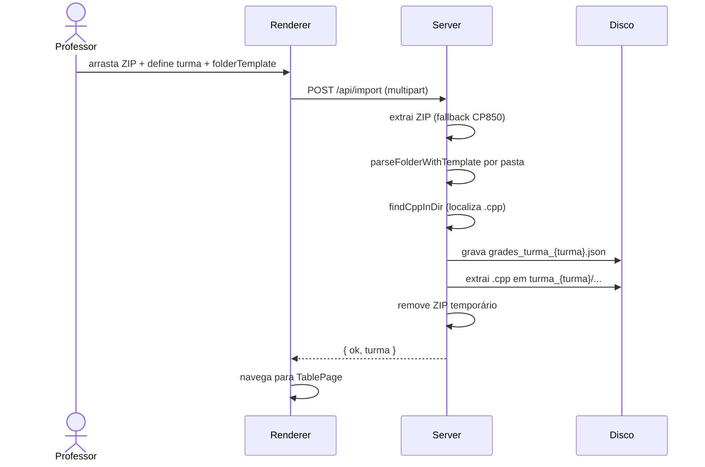
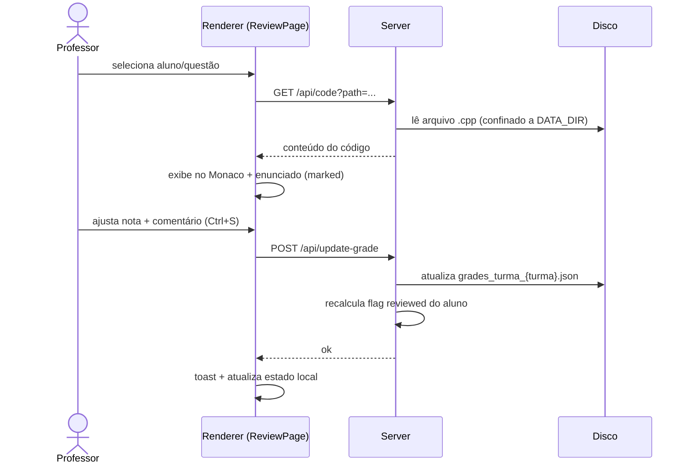
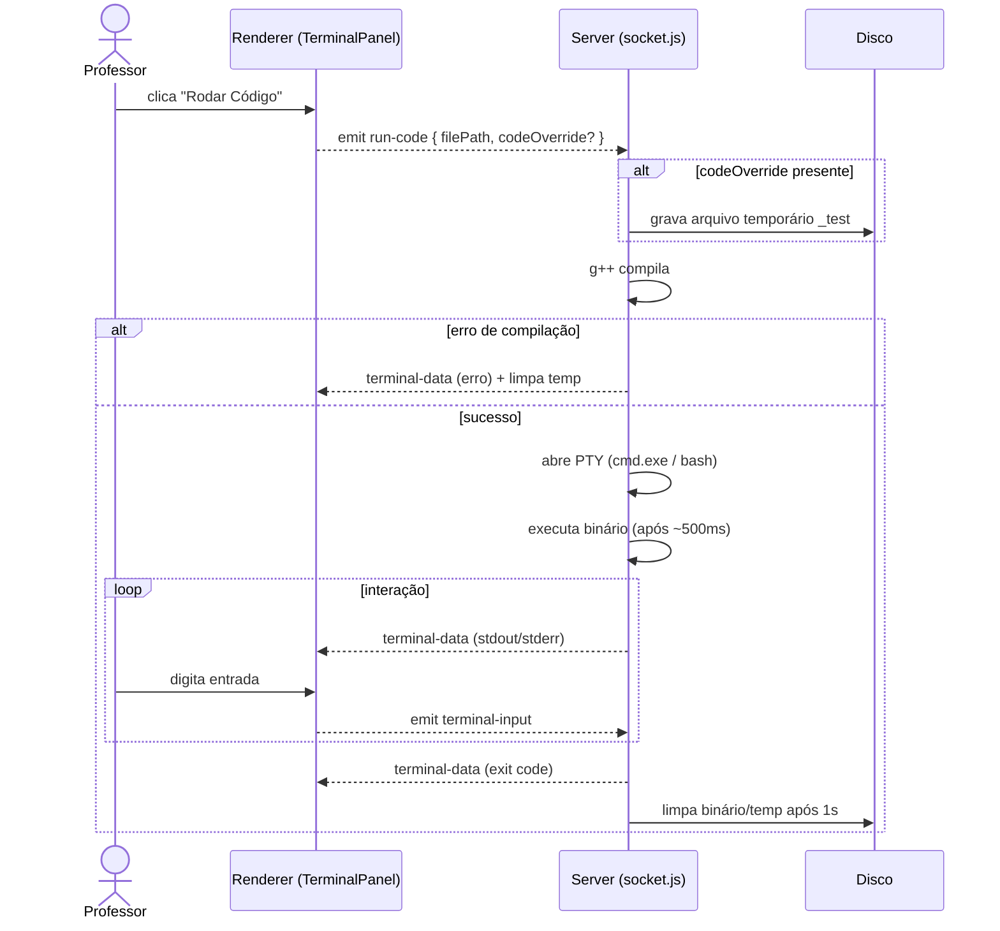
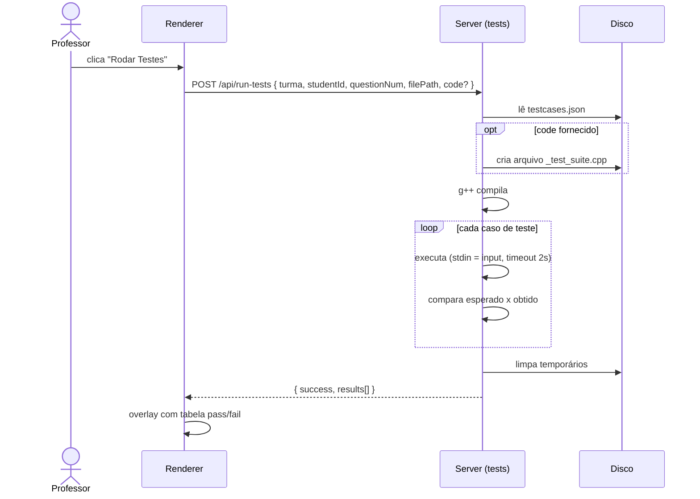
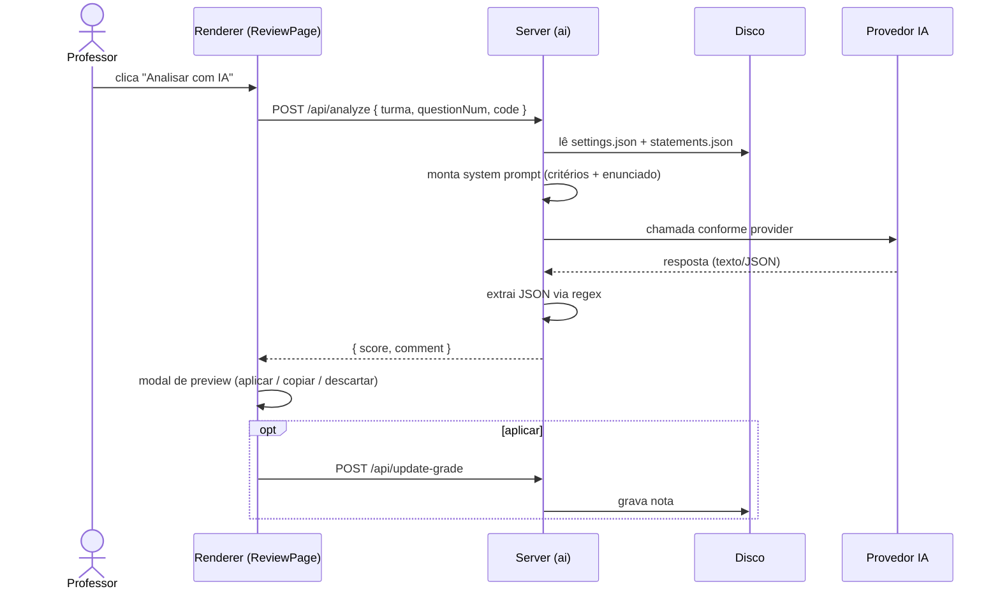
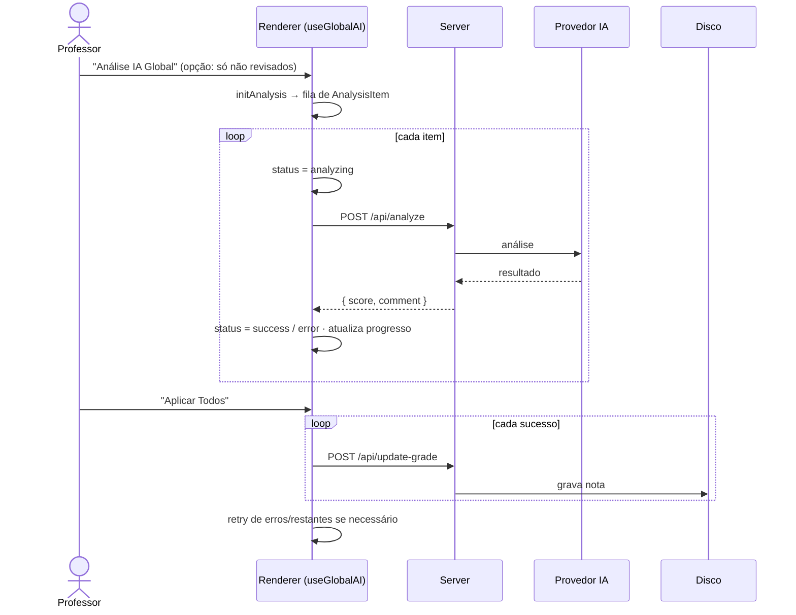
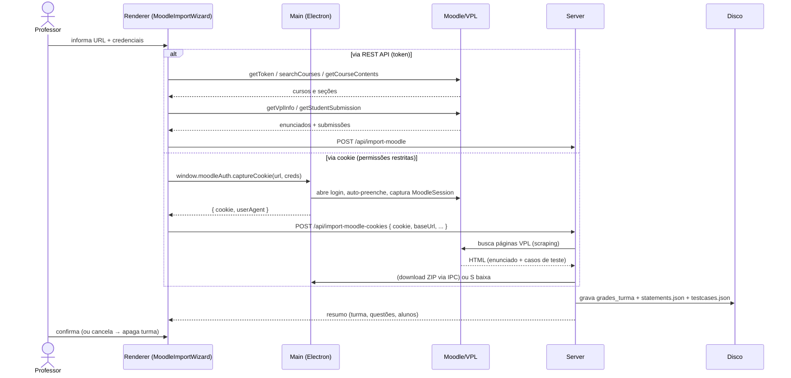
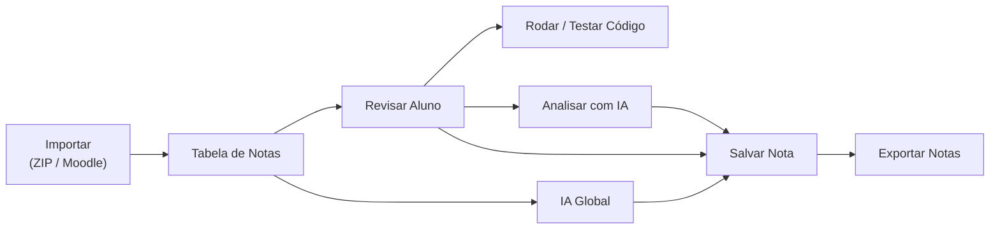

# Fluxos da Aplicação

Diagramas de sequência dos principais fluxos de uso, cobrindo frontend, backend, disco e serviços externos.

## Visão dos atores

| Ator | Papel |
|------|-------|
| **Professor** | Usuário final |
| **Renderer** | SPA React (client) |
| **Main** | Processo principal Electron |
| **Server** | Backend Express/Socket.IO (:3001) |
| **Disco** | `data/` (JSON + `.cpp`) |
| **IA** | Provedor selecionado (Ollama/OpenAI/Gemini/Claude) |
| **Moodle** | Servidor Moodle/VPL |

---

## 1. Importação via ZIP

---

## 2. Revisão e Correção de um Aluno

---

## 3. Execução Interativa de Código (Terminal)

---

## 4. Execução de Casos de Teste (VPL)

---

## 5. Análise por IA — Individual

---

## 6. Análise por IA — Global (em lote)

> O cancelamento usa `AbortController`; o estado é mantido por turma, permitindo retomar (`resumePendingAnalysis`).

---

## 7. Importação via Moodle / VPL

Combina REST API e fallback por cookie (capturado pelo processo Electron).

Ver [Integração Moodle/VPL](moodle-vpl-integration-guide.md) para detalhes.

---

## 8. Exportação e Importação de Notas

```mermaid
sequenceDiagram
    actor Prof as Professor
    participant R as Renderer (TablePage)
    participant S as Server
    participant D as Disco

    rect rgb(20,40,60)
    note over Prof,D: Exportar
    Prof->>R: "Exportar" (Excel ou JSON)
    alt Excel
        R->>R: gera .xlsx (xlsx) e baixa
    else JSON
        R->>S: GET /api/export-grades/:turma
        S->>D: lê grades_turma_{turma}.json
        S-->>R: JSON → download
    end
    end

    rect rgb(40,30,60)
    note over Prof,D: Importar
    Prof->>R: seleciona JSON de notas
    R->>S: POST /api/import-grades
    S->>D: mescla por folder_name/id (score+comment)
    S-->>R: ok
    end
```

---

## Resumo dos Fluxos

