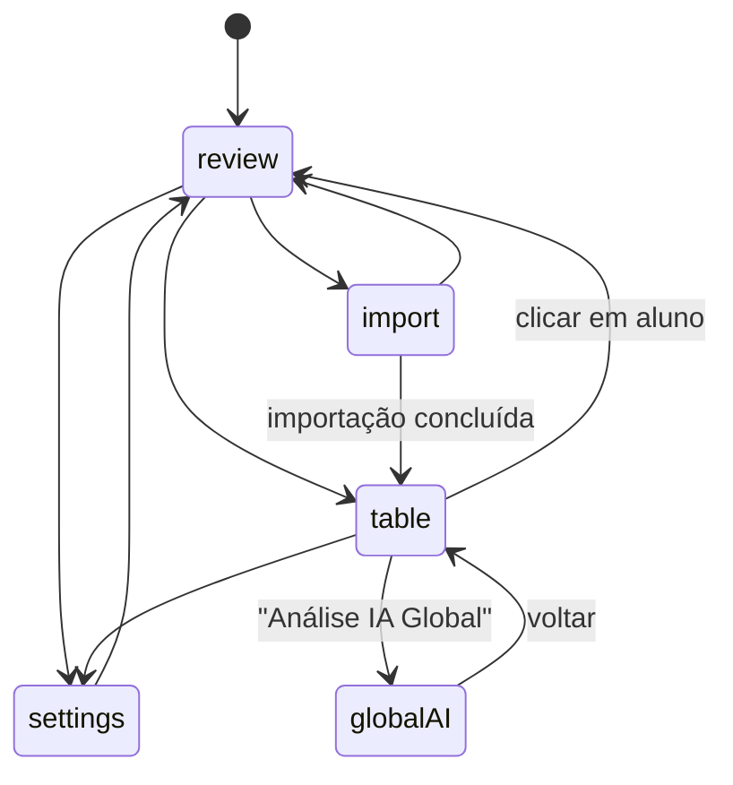

# Frontend

SPA em **React 19 + TypeScript + Vite + TailwindCSS v4**. A interface é voltada à correção de código C++: lista de alunos, editor, terminal, execução de testes e análise por IA.

## Estrutura

```
client/src/
├── main.tsx              # monta <App /> no DOM
├── App.tsx               # estado global, header, navegação por view
├── pages/
│   ├── ReviewPage.tsx    # revisão individual (editor + nota + IA + testes)
│   ├── TablePage.tsx     # planilha de notas + export/import + IA global
│   ├── ImportPage.tsx    # importação ZIP / Moodle
│   └── SettingsPage.tsx  # configuração de IA
├── components/
│   ├── Modal.tsx
│   ├── TerminalPanel.tsx
│   ├── MoodleImportWizard.tsx
│   └── GlobalAIAnalysisView.tsx
├── hooks/
│   ├── useReviewLogic.ts
│   └── useGlobalAI.ts
├── services/
│   ├── api.ts            # cliente REST
│   └── moodle.ts         # wrapper da REST API do Moodle
├── types/index.ts        # modelo de dados
├── translations.ts       # i18n pt-BR / en-US
└── index.css             # tema + Tailwind v4
```

## Navegação (por estado, sem router)

[App.tsx](../client/src/App.tsx) é a **fonte única de verdade**: mantém o estado elevado e troca de "página" por uma variável `view`.

```typescript
type View = 'review' | 'table' | 'import' | 'settings';
const [view, setView] = useState<View>('review');
```



O header (fixo) contém: alternância de **tema** (claro/escuro), seletor de **idioma** (pt-BR/en-US), seletor de **turma** (com ação de excluir) e as abas de navegação. As abas dependentes de turma ficam desabilitadas quando nenhuma turma está selecionada.

Estado global principal: `selectedTurma`, `currentIndex` (aluno), `currentQ` (questão), `view`, `showTerminal`, além de `students` e `pendingChanges`.

---

## Páginas

### ReviewPage — [pages/ReviewPage.tsx](../client/src/pages/ReviewPage.tsx)
Tela central de correção. Reúne:
- **Editor Monaco** (C++, tema sincronizado) com edição temporária (`tempCode`).
- **Enunciado** renderizado em Markdown/HTML num painel lateral redimensionável (persistido em `localStorage`).
- **Nota + comentário** com salvamento (atalho `Ctrl+S`).
- **Abas de questões** com indicadores de "alterado" e "revisado".
- **Análise por IA** individual (modal com preview do resultado).
- **Execução de código** (terminal) e **casos de teste** (overlay com tabela pass/fail).
- Navegação anterior/próximo aluno e sidebar de alunos.

Usa os hooks `useReviewLogic` (edição/salvamento/testes) e `useGlobalAI` (recebido do pai).

### TablePage — [pages/TablePage.tsx](../client/src/pages/TablePage.tsx)
Visão de planilha (alunos × questões):
- Totais coloridos por faixa de nota, média da turma e pesos exibidos em %.
- **Exportar** para Excel (`.xlsx`) ou JSON; **importar** JSON.
- Botão de **Análise IA Global** — quando ativa, renderiza `<GlobalAIAnalysisView />` no lugar da tabela.
- Clique numa linha leva à `ReviewPage` daquele aluno.
- Edição individual de nome/id do aluno (modal).

### ImportPage — [pages/ImportPage.tsx](../client/src/pages/ImportPage.tsx)
- Upload de ZIP com **drag-and-drop** e definição de `turma` + `folderTemplate`.
- Lançamento do **MoodleImportWizard**.
- Modal de ajuda sobre a hierarquia esperada do ZIP.
- Redireciona para a TablePage ao concluir.

### SettingsPage — [pages/SettingsPage.tsx](../client/src/pages/SettingsPage.tsx)
- Seleção de **provedor** de IA (Ollama/OpenAI/Gemini/Claude), modelo (com sugestões ou custom) e chave de API.
- **Critérios de avaliação** globais (textarea Markdown).
- Exibe a versão do app; desabilitada durante a análise IA global.

---

## Hooks Customizados

### useReviewLogic — [hooks/useReviewLogic.ts](../client/src/hooks/useReviewLogic.ts)
Orquestra a correção na ReviewPage:
- Carrega o código do aluno/questão atual (`code`) e mantém edições em `tempCode`.
- Detecta alterações pendentes (dirty tracking) e valida nota (força 0 sem arquivo).
- `handleSave` / `handleSaveAll` — persistem via `api.updateGrade`, atualizam estado local e exibem toasts.
- `handleToggleQuestionReviewed`, `handleDiscardChanges`.
- `handleRunTests` — executa casos de teste via `api.runTests` e expõe `testResults`.

### useGlobalAI — [hooks/useGlobalAI.ts](../client/src/hooks/useGlobalAI.ts)
Gerencia a análise IA em lote, **por turma** (`Record<string, TurmaAIState>`):
- `initAnalysis` monta a fila de itens (`AnalysisItem`); opção "apenas não revisados".
- `startAnalysis` itera os itens chamando `api.analyzeCode` e atualizando status (`pending → analyzing → success/error`).
- Cancelamento via `AbortController`; `resumePendingAnalysis`, `retryItem`, `retryAllErrors`, `retryAllRemaining`.
- `applyAll` grava em lote todos os resultados bem-sucedidos.
- `progress` calculado a partir da contagem de sucessos.

---

## Camada de Serviços

### api.ts — [services/api.ts](../client/src/services/api.ts)
Cliente `axios` que resolve a base URL dinamicamente (local, Electron e Codespaces). Cada endpoint REST do backend tem uma função correspondente (`getStudents`, `getCode`, `updateGrade`, `analyzeCode`, `runTests`, `importZip`, `importMoodle`, `importMoodleCookies`, `importGrades`, `exportGrades`, `getWeights`/`updateWeights`, `getStatements`/`updateStatements`, `getTestCases`, `getSettings`/`updateSettings`, `deleteTurma`). Ver o [mapa de rotas](backend.md#mapa-de-rotas-rest).

### moodle.ts — [services/moodle.ts](../client/src/services/moodle.ts)
Wrapper da **REST API do Moodle**: `getToken`, `moodleCall`, `searchCourses`, `getCourseContents`, `getEnrolledStudents`, `getVplInfo`, `getStudentSubmission`, `getStudentResult` e `parseCases` (parsing do formato VPL de casos de teste).

---

## Editor, Terminal e Conteúdo

- **Monaco** (`@monaco-editor/react`): editor C++ com tema sincronizado ao app. Edições são **temporárias** (não sobrescrevem o disco automaticamente). Ver [editor de código](implementacao-editor-codigo.md).
- **xterm.js** + `socket.io-client`: terminal interativo com modos **foco** (tela cheia) e **livre** (janela flutuante arrastável/redimensionável), persistidos em `localStorage`. Emite `terminal-resize`/`terminal-input` e recebe `terminal-data`.
- **marked**: enunciados renderizados via `dangerouslySetInnerHTML` sob `.markdown-content`. Ver [markdown e HTML](implementacao-markdown-html.md).

---

## Internacionalização ([translations.ts](../client/src/translations.ts))

Objeto `translations` com dois idiomas — **pt-BR** e **en-US** (~220 chaves cada). Uso: `const t = translations[lang]`. Troca pelo seletor no header; cobre navegação, formulários, botões, toasts, ajuda, resultados de teste e o assistente do Moodle.

---

## Tema e Estilo

CSS variables em [index.css](../client/src/index.css) sob temas **dark** (padrão) e **light** (`:root.light`), mapeadas ao Tailwind v4 via `@theme`. A preferência de tema é persistida em `localStorage`. Detalhes completos em [Identidade Visual](identidade-visual-estilos.md).

---

## Build Tooling

| Arquivo | Configuração |
|---------|--------------|
| [vite.config.ts](../client/vite.config.ts) | plugin React; `base: './'` (caminhos relativos para Electron/Codespaces) |
| [tailwind.config.js](../client/tailwind.config.js) | `content` aponta para `index.html` e `src/**`; tema real vem das CSS variables |
| [tsconfig.json](../client/tsconfig.json) | referências a `tsconfig.app.json` e `tsconfig.node.json` |

## Padrões do Frontend
- Estado elevado em `App.tsx`; `useCallback`/`useMemo` para memoização.
- `localStorage` para tema, modo do terminal e layout do painel de enunciado.
- `try/catch` em chamadas async + toasts para feedback; `AbortController` para cancelamento.
- Composição via `Modal` reutilizável; *props drilling* de até ~3-4 níveis.
