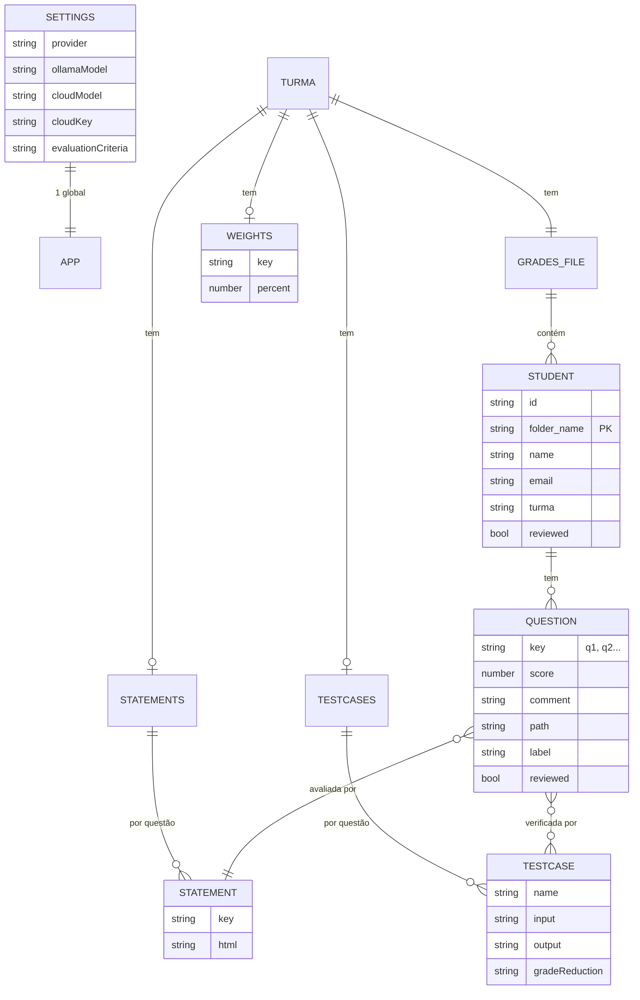

# Modelo de Dados

O CPP Review App **não usa banco de dados relacional**. Toda a persistência é feita em **arquivos JSON** e arquivos `.cpp` no diretório de dados local. Este documento descreve o esquema, os relacionamentos e a organização em disco.

## Onde os dados vivem

| Ambiente | `DATA_DIR` |
|----------|-----------|
| Electron (empacotado) | `{userData}/data` (ex: `%APPDATA%/Review App/data` no Windows) |
| Node.js (dev sem Electron) | `{repo}/data` |

> O diretório `data/` está **fora do controle de versão** por conter dados de alunos e chaves de API.

## Estrutura de diretórios

```
data/
├── settings.json                      # configuração global de IA
├── uploads/                           # ZIPs temporários (multer)
├── grades_turma_{Turma}.json          # notas de uma turma (1 por turma)
└── turma_{Turma}/                     # recursos da turma
    ├── statements.json                # enunciados por questão
    ├── testcases.json                 # casos de teste por questão
    ├── weights.json                   # pesos (%) por questão
    └── {pastaQuestao}/
        └── {pastaAluno}/
            └── *.cpp                  # submissão do aluno
```

A nomenclatura de arquivos por turma usa o nome da turma como sufixo/segmento (`grades_turma_{Turma}.json`, `turma_{Turma}/...`). Ver [Convenções de Nomes](convencoes-de-nomes.md).

---

## Diagrama Entidade-Relacionamento (lógico)

Embora seja armazenamento em arquivos, as entidades têm relações lógicas:



A chave de relacionamento entre questões e seus enunciados/casos de teste/pesos é a **chave da questão** (`q1`, `q2`, ...). O identificador estável de um aluno dentro de uma turma é `folder_name`.

---

## Esquemas dos Arquivos

### `settings.json`
Configuração global de IA (única no app).

```json
{
  "provider": "ollama",
  "ollamaModel": "llama3",
  "cloudModel": "gemini-1.5-flash-lite",
  "cloudKey": "",
  "evaluationCriteria": "Sistema de correção: ..."
}
```

### `grades_turma_{Turma}.json`
Array de alunos com suas questões. **Arquivo central** de notas.

```json
[
  {
    "folder_name": "john_doe_12345",
    "name": "John Doe",
    "id": "12345",
    "email": "john@example.com",
    "turma": "Prova 1 - Turma A",
    "reviewed": false,
    "questions": {
      "q1": {
        "score": 0,
        "comment": "",
        "path": "/.../turma_Prova 1/q1/john_doe_12345/main.cpp",
        "label": "Q1 - Soma de dois números",
        "reviewed": false
      }
    }
  }
]
```

| Campo | Tipo | Notas |
|-------|------|-------|
| `folder_name` | string | Identificador único do aluno na turma |
| `id` | string | Matrícula |
| `name` / `email` | string | Metadados extraídos via template |
| `turma` | string | Injetado em runtime por `getStudents` |
| `reviewed` | boolean | Verdadeiro quando todas as questões foram revisadas |
| `questions` | objeto | Mapa `q{n}` → questão |

**Question:**
| Campo | Tipo | Notas |
|-------|------|-------|
| `score` | number | 0–100 (forçado a 0 se `path` é nulo) |
| `comment` | string | Feedback |
| `path` | string \| null | Caminho do `.cpp` em disco |
| `label` | string | Rótulo opcional da questão |
| `reviewed` | boolean | Questão revisada |

### `turma_{Turma}/statements.json`
Enunciado (HTML/Markdown) por questão.

```json
{ "q1": "<html>Descrição do problema...</html>", "q2": "..." }
```

### `turma_{Turma}/testcases.json`
Casos de teste por questão (estilo VPL).

```json
{
  "q1": [
    { "name": "Caso 1", "input": "5", "output": "120", "gradeReduction": "10" }
  ]
}
```

### `turma_{Turma}/weights.json`
Peso percentual de cada questão para o cálculo da nota.

```json
{ "q1": 40, "q2": 60 }
```

---

## Operações de Persistência (resumo)

| Arquivo | Leitura | Escrita |
|---------|---------|---------|
| `settings.json` | `GET /settings` | `POST /settings` |
| `grades_turma_*.json` | `GET /students`, `GET /export-grades/:turma` | importação, `POST /update-grade`, `POST /update-student`, `POST /import-grades` |
| `statements.json` | `GET /statements` | `POST /statements`, importação |
| `testcases.json` | `GET /testcases` | importação (Moodle/cookies) |
| `weights.json` | `GET /weights` | `POST /weights` |
| `*.cpp` | `GET /code` | importação (extração de ZIP) |

> Tipos correspondentes no frontend: [client/src/types/index.ts](../client/src/types/index.ts) (`Student`, `Question`, `AISettings`, `AIResult`, `AnalysisItem`, `PendingChanges`).
