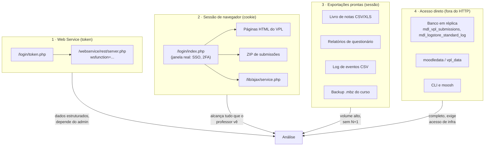
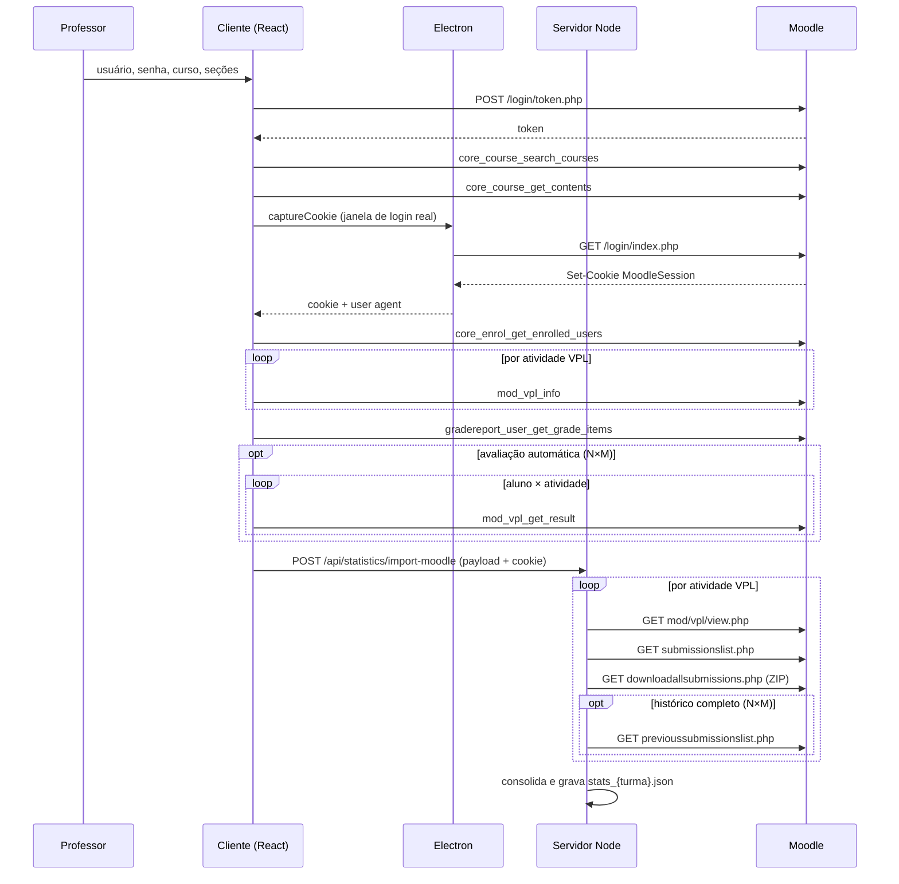

# Extração de dados do Moodle — análise consolidada

Documentação **de análise**, não de configuração: o mapa completo de por onde os
dados pedagógicos podem sair de uma instância Moodle com o plugin VPL, o que cada
caminho entrega, o que cada um custa e o que ele exige de permissão.

Cobre tanto o que o CPP Review App usa hoje quanto o que é conhecido e utilizável
mas ainda não foi usado — porque a pergunta que motiva este material é *"que
análise ainda seria possível com esta base?"*, e ela só se responde sabendo o que
existe.

> Para **configurar** a integração (habilitar Web Services, criar serviço, gerar
> token, checklist do admin) o documento é outro:
> [`../moodle-vpl-integration-guide.md`](../moodle-vpl-integration-guide.md).
> Aqui não se repete aquele conteúdo.

---

## Arquivos desta pasta

| Arquivo | Conteúdo |
|---------|----------|
| [`moodle-api.yaml`](moodle-api.yaml) | **OpenAPI 3.1** de todas as rotas HTTP: Web Service, autenticação, arquivos, páginas do VPL, relatórios e API interna. Abra no Swagger UI ou no Redoc. |
| [`web-services.md`](web-services.md) | Referência função a função do Web Service: parâmetros, retorno, capacidade exigida, custo e armadilhas. |
| [`extracao-por-sessao.md`](extracao-por-sessao.md) | Extração **sem** Web Service: cookie de sessão, espelhamento de páginas, ZIPs do VPL, `sesskey`, API AJAX interna. |
| [`extracao-por-arquivos.md`](extracao-por-arquivos.md) | Exportações prontas do Moodle: livro de notas, relatórios de questionário, logs, backup `.mbz`. |
| [`extracao-direta.md`](extracao-direta.md) | Fora do HTTP: leitura do banco em réplica, `moodledata`, CLI e `moosh`. |
| [`limites-permissoes-e-privacidade.md`](limites-permissoes-e-privacidade.md) | Capacidades por rota, custo/N+1, limites de volume, dados pessoais e retenção. |

## Níveis de confiança

Cada rota e cada função nesta pasta carrega um marcador. Ele é o mais importante
de ler antes de automatizar algo:

| Marcador | Significa |
|----------|-----------|
| **[USADA]** | O projeto chama esta rota hoje. Os campos documentados foram lidos do código que os consome — são verdade para a instância em uso. |
| **[CERTA]** | Integração conhecida e estável do Moodle/VPL, que o projeto não usa. Parâmetros são confiáveis; do retorno são descritos os campos principais, não a lista exaustiva. |
| **[CONFIRMAR]** | O caminho existe, mas nome de parâmetro ou de campo varia com versão, tema ou idioma. Inspecione na sua instância antes de automatizar. |

Nada aqui foi documentado por suposição: quando não havia certeza do formato
exato, o item ficou marcado como **[CONFIRMAR]** com a indicação do que checar.

---

## Os quatro caminhos de extração

O projeto usa **1 e 2 combinados**, e é uma escolha deliberada: o Web Service
entrega dados estruturados mas depende do administrador ter habilitado cada
função; a sessão alcança tudo que o professor vê, mas em HTML frágil. Um cobre a
lacuna do outro, e cada fonte que falha é registrada em `warnings` em vez de
derrubar a importação.

---

## Mapa de decisão: que dado quero, por onde ele sai

| Dado pedagógico | Melhor caminho | Alternativa | Hoje no app |
|-----------------|----------------|-------------|-------------|
| Lista de alunos matriculados | `core_enrol_get_enrolled_users` | Tabela de participantes (HTML) | ✅ WS |
| Nome, e-mail, matrícula | idem | `core_user_get_users_by_field` | ✅ WS |
| Grupos da turma | idem (`groups[]`) | `core_group_get_course_groups` | ✅ (vem junto) |
| Último acesso ao curso | idem (`lastcourseaccess`) | Log de eventos | ✅ (vem junto) |
| Estrutura do curso, seções, atividades | `core_course_get_contents` | Página do curso (HTML) | ✅ WS |
| Prazo da atividade | idem (`dates[]`) | `mod/vpl/view.php` | ✅ ambos |
| Enunciado | `mod_vpl_info` (`intro`) | `mod/vpl/view.php` → `div#vpl_intro` | ✅ ambos |
| Casos de teste | `mod_vpl_info` → `vpl_evaluate.cases` | `mod/vpl/view.php` → `pre#codefileid1` | ✅ ambos |
| Nota automática por aluno | `mod_vpl_get_result` | Lista de submissões; livro de notas | ✅ três fontes |
| **Casos de teste reprovados** | `mod_vpl_get_result` (`evaluation`) | — | ✅ WS apenas |
| **Erros de compilação** | `mod_vpl_get_result` (`compilation`) | — | ✅ WS apenas |
| Nota lançada no livro de notas | `gradereport_user_get_grade_items` | Exportação CSV do livro de notas | ✅ WS |
| Código-fonte de toda a turma | **ZIP `downloadallsubmissions.php`** | `mod_vpl_open` (1 chamada por aluno) | ✅ ZIP |
| Carimbo exato da submissão | **nome da pasta dentro do ZIP** | Lista de submissões (data localizada) | ✅ ZIP |
| Número de tentativas | Lista de submissões | Histórico de tentativas | ✅ ambos |
| Histórico tentativa a tentativa | `previoussubmissionslist.php` | Banco (`mdl_vpl_submissions`) | ✅ opcional |
| Conclusão de atividade | `core_completion_get_activities_completion_status` | — | ❌ |
| **Visualizações e acessos** (quem abriu o enunciado, quando) | **Log de eventos** (CSV ou banco) | — | ❌ *(ver abaixo)* |
| Participação em fórum | `mod_forum_get_forums_by_courses` | — | ❌ |
| Tarefas (mod_assign) | `mod_assign_get_submissions` / `?action=downloadall` | — | ❌ |
| Questionários | `mod_quiz_get_user_attempts` / relatório CSV | — | ❌ |
| Curso inteiro, tudo junto | **Backup `.mbz`** | — | ❌ |

### A lacuna que mais pesa hoje

**Não existe função de Web Service para o log de eventos** no Moodle padrão. Isso
significa que o app hoje não distingue dois alunos que igualmente não entregaram:

- o que **nunca abriu** o enunciado — desengajamento;
- o que abriu dez vezes, baixou o material e não conseguiu submeter — dificuldade.

Os dois aparecem como "nenhuma entrega, risco crítico 60". A informação que os
separa existe, e sai por dois caminhos: o relatório de logs em CSV
([`extracao-por-arquivos.md`](extracao-por-arquivos.md#log-de-eventos)) ou a
tabela `mdl_logstore_standard_log`
([`extracao-direta.md`](extracao-direta.md#tabelas-de-interesse)). É a extensão de
maior retorno pedagógico que esta análise identificou.

---

## Inventário completo de rotas

Detalhe de cada uma em [`moodle-api.yaml`](moodle-api.yaml).

### Autenticação

| Rota | Nível | Onde no projeto |
|------|-------|-----------------|
| `POST /login/token.php` | [USADA] | `client/src/services/moodle.ts` → `getToken` |
| `GET /login/index.php` | [USADA] | `electron-main.js` → IPC `open-moodle-login` |
| `POST /login/index.php` | [CONFIRMAR] | — (exigiria `logintoken`; quebra com SSO/2FA) |

### Web Service — `POST /webservice/rest/server.php`

Oito funções em uso:

| `wsfunction` | Entrega |
|--------------|---------|
| `core_course_search_courses` | Busca de cursos |
| `core_course_get_contents` | Seções, atividades, cmid, prazos |
| `core_enrol_get_enrolled_users` | Alunos, e-mail, grupos, último acesso |
| `gradereport_user_get_grade_items` | Livro de notas do curso |
| `mod_vpl_info` | Enunciado, nota máxima, datas, casos de teste |
| `mod_vpl_open` | Arquivos submetidos por um aluno |
| `mod_vpl_get_result` | Nota, casos reprovados, erros de compilação |
| `core_webservice_get_site_info` | *(recomendada, ainda não usada)* diagnóstico do token |

Mais 18 funções [CERTA] catalogadas em [`web-services.md`](web-services.md).

### Páginas e downloads do VPL (sessão)

| Rota | Nível | Entrega |
|------|-------|---------|
| `GET /mod/vpl/view.php` | [USADA] | Enunciado, casos, datas, nota máxima |
| `GET /mod/vpl/views/submissionslist.php` | [USADA] | Data, tentativas, nota, avaliação por aluno |
| `GET /mod/vpl/views/downloadallsubmissions.php` | [USADA] | **ZIP** com o código de toda a turma |
| `GET /mod/vpl/views/previoussubmissionslist.php` | [USADA] | Histórico de tentativas de um aluno |
| `GET /mod/vpl/views/submissionview.php` | [CERTA] | Uma submissão, com código e avaliação |
| `GET /mod/vpl/views/downloadsubmission.php` | [CERTA] | ZIP de um único aluno |

### Arquivos, relatórios e API interna

| Rota | Nível | Entrega |
|------|-------|---------|
| `GET /webservice/pluginfile.php/...` | [CERTA] | Arquivo por token |
| `GET /pluginfile.php/...` | [CERTA] | Arquivo por sessão |
| `GET /grade/export/{txt,xls,ods,xml}/index.php` | [CERTA] / [CONFIRMAR] | Livro de notas em arquivo |
| `GET /mod/assign/view.php?action=downloadall` | [CERTA] | ZIP das entregas de uma Tarefa |
| `GET /mod/quiz/report.php?mode=responses&download=csv` | [CERTA] / [CONFIRMAR] | Respostas de questionário |
| `GET /report/log/index.php?download=csv` | [CERTA] / [CONFIRMAR] | Log de eventos do curso |
| `POST /lib/ajax/service.php` | [CERTA] | API interna, em lote, autenticada por sessão |

---

## O que este projeto extrai, em ordem de execução

Sequência real da importação de estatísticas (`StatisticsImportWizard` →
`statistics.controller.js`), útil para entender como as fontes se compõem:

Note o padrão: **o cliente busca o que o token alcança, o servidor espelha o
resto**. As duas chamadas em `loop` marcadas como N×M são as que dominam o tempo
de importação — por isso são opcionais na interface.

---

## Onde cada coisa está no código

| Arquivo | Papel na extração |
|---------|-------------------|
| [client/src/services/moodle.ts](../../client/src/services/moodle.ts) | Cliente do Web Service (`getToken`, `moodleCall`) e parser de `vpl_evaluate.cases` |
| [electron-main.js](../../electron-main.js) | Janela de login, captura do cookie, download de ZIP autenticado |
| [server/src/features/statistics/moodleHarvester.js](../../server/src/features/statistics/moodleHarvester.js) | Sessão HTTP e **todos os parsers de HTML** |
| [server/src/features/statistics/statistics.controller.js](../../server/src/features/statistics/statistics.controller.js) | Orquestra a coleta, lê o ZIP, consolida o dataset |
| [server/src/features/import/import.controller.js](../../server/src/features/import/import.controller.js) | Mesma coleta para a aba de Revisão (foco em código) |

## Documentos relacionados

- [Guia de integração Moodle + VPL](../moodle-vpl-integration-guide.md) — configuração e checklist do administrador.
- [Estatísticas da Turma](../estatisticas.md) — o que é calculado a partir destes dados.
- [Fluxos da Aplicação](../fluxos-da-aplicacao.md) — diagramas de sequência das importações.
