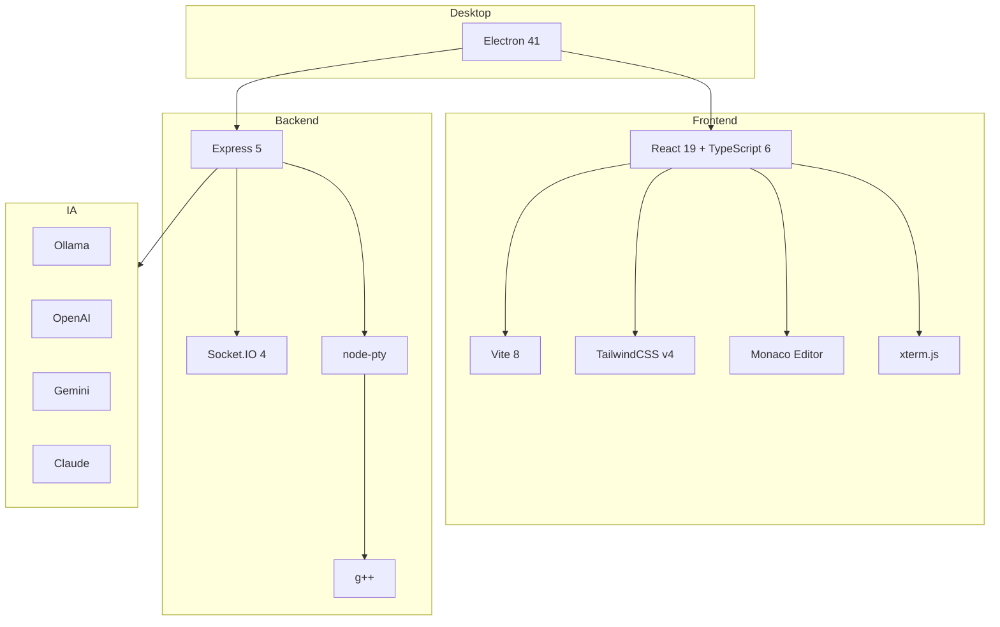

# Tecnologias e Bibliotecas

Inventário completo do stack tecnológico do **CPP Review App**, organizado por camada, com a função de cada dependência.

## Resumo do Stack

---

## Plataforma Desktop (raiz)

| Tecnologia | Versão | Função |
|------------|--------|--------|
| **Electron** | ^41.7.0 | Empacota o app desktop; processo principal inicia servidor e janela |
| **electron-builder** | ^26.8.1 | Geração de instaladores (NSIS no Windows) |
| **concurrently** | ^8.2.2 | Roda Vite e Electron em paralelo no dev |

A raiz também declara as mesmas dependências de runtime do servidor (SDKs de IA, `node-pty`, `socket.io`, etc.), pois o servidor é empacotado junto e executado pelo processo principal.

---

## Frontend (`/client`)

### Núcleo
| Biblioteca | Versão | Função |
|------------|--------|--------|
| **react** / **react-dom** | ^19.2.5 | Framework de UI |
| **typescript** | ~6.0.2 | Tipagem estática |
| **vite** | ^8.0.10 | Dev server (HMR) e bundler de produção |
| **@vitejs/plugin-react** | ^6.0.1 | Suporte a JSX e Fast Refresh |

### UI e Estilo
| Biblioteca | Versão | Função |
|------------|--------|--------|
| **@tailwindcss/postcss** / TailwindCSS | v4 | Utilitários CSS com integração via `@theme` e CSS variables |
| **lucide-react** | ^1.14.0 | Ícones (consistentes, leves) |
| **react-hot-toast** | ^2.6.0 | Notificações (toasts) |

### Editor, Terminal e Conteúdo
| Biblioteca | Versão | Função |
|------------|--------|--------|
| **@monaco-editor/react** | ^4.7.0 | Editor de código C++ (motor do VS Code). Ver [editor de código](implementacao-editor-codigo.md) |
| **xterm** | ^5.3.0 | Emulador de terminal no navegador |
| **@xterm/addon-fit** | ^0.11.0 | Ajuste automático do terminal ao container |
| **marked** | ^18.0.3 | Renderização de Markdown/HTML dos enunciados. Ver [markdown e HTML](implementacao-markdown-html.md) |
| **prismjs** | ^1.30.0 | Realce de sintaxe auxiliar |

### Comunicação e Dados
| Biblioteca | Versão | Função |
|------------|--------|--------|
| **axios** | ^1.15.2 | Cliente HTTP para a API REST |
| **socket.io-client** | ^4.8.3 | Conexão WebSocket com o terminal do backend |
| **xlsx** | ^0.18.5 | Exportação de notas para Excel (`.xlsx`) |

### Qualidade
| Biblioteca | Função |
|------------|--------|
| **eslint** + **typescript-eslint** | Linting |
| **eslint-plugin-react-hooks** / **react-refresh** | Regras específicas de React |

---

## Backend (`/server`)

### Servidor e Infra
| Biblioteca | Versão | Função |
|------------|--------|--------|
| **express** | ^5.2.1 | Servidor HTTP / roteamento REST |
| **socket.io** | ^4.8.3 | WebSocket para terminal interativo |
| **cors** | ^2.8.6 | Habilita CORS (todas as origens) |
| **body-parser** | ^2.2.2 | Parsing de JSON (limite 50MB) |
| **multer** | ^2.1.1 | Upload de arquivos ZIP |

### Execução de Código e Arquivos
| Biblioteca | Versão | Função |
|------------|--------|--------|
| **node-pty** | ^1.1.0 | Pseudo-terminal para execução interativa de binários compilados |
| **adm-zip** | ^0.5.17 | Extração de ZIPs de submissões |
| **iconv-lite** | ^0.7.2 | Decodificação de nomes de arquivo (fallback CP850) em ZIPs |
| **g++** | (sistema) | Compilador C++ — deve estar no PATH |

### Integração de IA
| SDK | Versão | Provedor |
|-----|--------|----------|
| **ollama** | ^0.6.3 | Modelos locais (padrão `llama3`) |
| **openai** | ^6.35.0 | GPT (ex: `gpt-4o`) |
| **@google/generative-ai** | ^0.24.1 | Gemini |
| **@anthropic-ai/sdk** | ^0.92.0 | Claude |

Todos os provedores recebem o mesmo *system prompt* (critérios de avaliação + enunciado) e devem retornar JSON `{ score, comment }`. Ver [Backend → Feature AI](backend.md#feature-ai).

---

## Integração Moodle / VPL

A importação do Moodle usa duas estratégias complementares:

1. **REST API do Moodle** ([moodle.ts](../client/src/services/moodle.ts)) — autenticação por token e chamadas a `webservice/rest/server.php`.
2. **Fallback por cookies** — quando a API tem permissões restritas, o processo principal do Electron captura o cookie `MoodleSession` (IPC) e o backend faz scraping das páginas VPL.

Ver [Integração Moodle/VPL](moodle-vpl-integration-guide.md) e [Fluxos](fluxos-da-aplicacao.md#importação-via-moodle).

---

## Versões de Runtime

| Requisito | Versão mínima |
|-----------|---------------|
| Node.js | 18+ |
| g++ | qualquer com suporte a C++ moderno, no PATH |
| Ollama | opcional, para IA local (porta 11434) |
