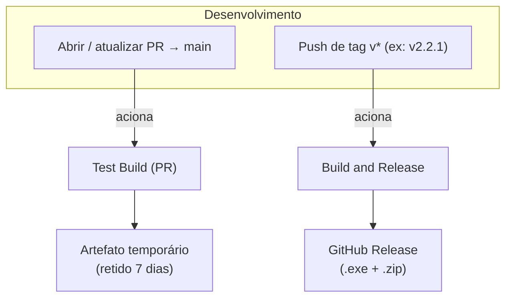
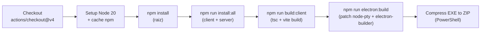
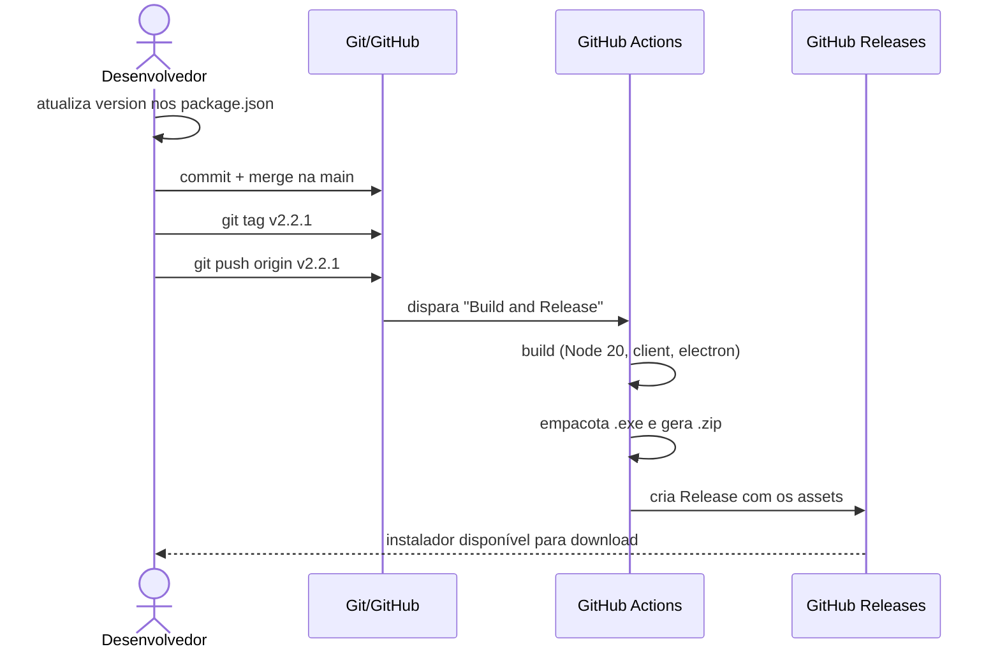

# Workflows de CI/CD (GitHub Actions)

O projeto possui dois workflows do **GitHub Actions** em `.github/workflows/`, responsáveis por validar builds em Pull Requests e por gerar releases empacotadas automaticamente. Ambos rodam em **`windows-latest`**, pois o produto final é um instalador Windows (NSIS) que depende de dependências nativas como `node-pty`.

| Workflow | Arquivo | Gatilho | Resultado |
|----------|---------|---------|-----------|
| **Test Build (PR)** | [test-build.yml](../.github/workflows/test-build.yml) | Pull Request para `main` ou disparo manual | Artefato de teste (não publicado) |
| **Build and Release** | [release.yml](../.github/workflows/release.yml) | Push de tag `v*` | Release no GitHub com `.exe` e `.zip` |

---

## Visão Geral



A diferença essencial entre os dois é apenas a **etapa final**:
- O **Test Build** apenas **valida** que o app compila e empacota, guardando o resultado como artefato temporário.
- O **Release** **publica** o resultado como uma Release oficial no GitHub.

As etapas de preparação e build são idênticas nos dois.

---

## Etapas Compartilhadas

Ambos os workflows executam a mesma sequência de build:



| Etapa | Comando / Action | O que faz |
|-------|------------------|-----------|
| **Checkout Code** | `actions/checkout@v4` | Clona o repositório |
| **Setup Node.js** | `actions/setup-node@v4` (Node 20, `cache: npm`) | Instala o Node e habilita cache de dependências |
| **Install Root Dependencies** | `npm install` | Dependências da raiz (Electron, builder, SDKs) |
| **Install All Dependencies** | `npm run install:all` | Instala em `client` e `server` |
| **Build Client** | `npm run build:client` | `tsc -b && vite build` → `client/dist` |
| **Build Electron App** | `npm run electron:build` | Aplica patch no `node-pty`, builda o client e empacota com `electron-builder` → `dist-electron/` |
| **Compress EXE to ZIP** | PowerShell (`pwsh`) | Para cada `.exe` em `dist-electron/`, gera um `*-win-exe.zip` |

> A etapa de compressão para ZIP existe porque arquivos `.exe` soltos podem ser bloqueados por navegadores/antivírus no download; o `.zip` oferece uma alternativa mais segura para distribuição.

A variável `GITHUB_TOKEN` (de `secrets.GITHUB_TOKEN`) é injetada na etapa de build do Electron — o `electron-builder` pode usá-la para operações relacionadas ao GitHub.

---

## Workflow 1 — Test Build (PR)

**Arquivo:** [.github/workflows/test-build.yml](../.github/workflows/test-build.yml)

### Gatilhos
```yaml
on:
  pull_request:
    branches:
      - main
  workflow_dispatch:
```
- **`pull_request` → `main`**: roda automaticamente a cada abertura/atualização de PR direcionado à `main`.
- **`workflow_dispatch`**: permite disparo manual pela aba *Actions* do GitHub.

### Objetivo
Garantir que qualquer alteração proposta **continua compilando e empacotando** antes de ser mesclada na `main` — funciona como um "portão de qualidade" de build.

### Etapa final exclusiva
```yaml
- name: Upload Build Artifacts
  uses: actions/upload-artifact@v4
  with:
    name: test-build-windows
    path: |
      dist-electron/*.exe
      dist-electron/*.zip
    retention-days: 7
```
Sobe os binários como **artefato** chamado `test-build-windows`, **retido por 7 dias**. Não cria release — serve apenas para inspeção/teste manual do build daquele PR.

---

## Workflow 2 — Build and Release

**Arquivo:** [.github/workflows/release.yml](../.github/workflows/release.yml)

### Gatilho
```yaml
on:
  push:
    tags:
      - 'v*'
```
Dispara **somente** quando uma tag iniciada por `v` é enviada (ex: `v2.2.1`). É o mecanismo oficial de publicação de versões.

### Permissões
```yaml
permissions:
  contents: write
```
Necessário para que o job possa **criar a Release** e anexar arquivos no repositório.

### Etapa final exclusiva
```yaml
- name: Create Release
  uses: softprops/action-gh-release@v2
  with:
    files: |
      dist-electron/*.exe
      dist-electron/*.zip
  env:
    GITHUB_TOKEN: ${{ secrets.GITHUB_TOKEN }}
```
Usa a action `softprops/action-gh-release@v2` para criar a **GitHub Release** associada à tag, anexando o instalador `.exe` e o `.zip` como assets para download.

---

## Como Publicar uma Nova Versão



Passos práticos:

1. Atualize o campo `version` nos `package.json` (raiz, `client` e `server` devem ficar sincronizados — atualmente `2.2.1`).
2. Faça o merge das alterações na `main`.
3. Crie e envie a tag correspondente:
   ```bash
   git tag v2.2.1
   git push origin v2.2.1
   ```
4. O workflow **Build and Release** roda automaticamente e publica o instalador na aba *Releases*.

> Convenção de tag: prefixo `v` + versão semântica (`vMAJOR.MINOR.PATCH`), alinhada à versão dos `package.json`. Ver [Convenções de Nomes](convencoes-de-nomes.md#versionamento).

---

## Observações e Possíveis Melhorias

- **Sem etapa de testes automatizados:** o script `test` nos `package.json` apenas falha (`echo "Error: no test specified"`). Os workflows validam **build**, não comportamento. Adicionar testes (unitários/E2E) e uma etapa de lint (`npm run lint --prefix client`) fortaleceria o portão de qualidade.
- **Apenas Windows:** os builds rodam só em `windows-latest`. Para distribuir para Linux/macOS seria preciso uma matriz de SO (`strategy.matrix`) e targets adicionais no `electron-builder`.
- **Duplicação:** as etapas de build são repetidas nos dois arquivos. Poderiam ser centralizadas em um *reusable workflow* (`workflow_call`) ou *composite action* para reduzir manutenção.
